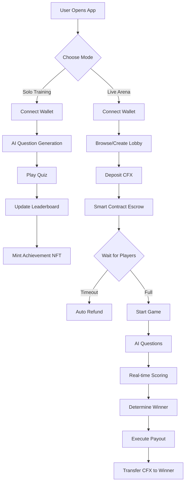
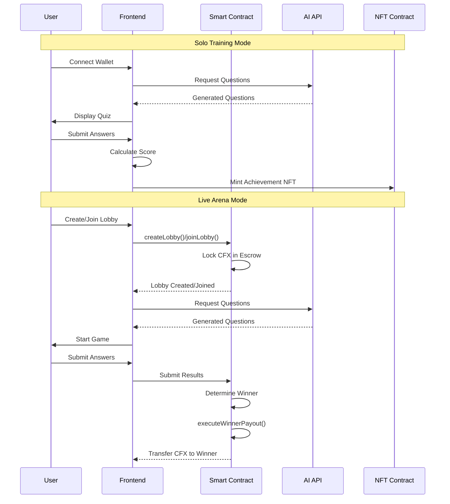

# 🧠 QuizCraft AI - Conflux Hackathon Submission

[](https://confluxnetwork.org/)
[](https://nextjs.org/)
[](https://soliditylang.org/)
[](https://www.typescriptlang.org/)


#### A dynamic, AI-powered quiz platform on Conflux eSpace where users instantly play solo for points and NFTs or compete in live PvP matches for CFX prizes, leveraging Conflux's high throughput and low fees.

## 🎯 Live Demo

🌐 **Live Application**: [https://quiz-craft-vjl5.vercel.app/](https://quiz-craft-sepia.vercel.app/)

📱 **Testnet**: Conflux eSpace Testnet  
🔗 **Contract**: [View on ConfluxScan](https://evmtestnet.confluxscan.org/)

## 🚀 Problem & Solution

### The Problem
- Traditional quiz apps are centralized with repetitive content
- No real ownership or monetary rewards
- High and unpredictable fees on other blockchains
- Micro-transactions for quizzes are impractical

### Our Solution
**QuizCraft AI** is built natively on **Conflux eSpace**, utilizing its low transaction costs and fast finality to enable a seamless, rewarding quiz experience with a dual-mode system:

1. **🎮 Solo Training Mode**: Instantly play AI-generated quizzes to earn points and win NFTs—no waiting, no fees
2. **⚔️ Live Arena Mode**: Deposit CFX to enter competitive, winner-takes-all matches with transparent smart contract payouts

## ✨ Key Features

### 🤖 AI-Powered Question Generation
- Dynamic, unique questions generated using OpenAI GPT-4
- Multiple difficulty levels and categories
- Real-time question generation for each game
- Verifiable fairness through on-chain question hashing

### 💰 CFX-Based Economy
- **Entry Fees**: Small CFX deposits (0.1 - 2 CFX)
- **Prize Pools**: Winner-takes-all CFX distribution
- **Automatic Refunds**: Failed lobbies auto-refund participants
- **Low Fees**: Leveraging Conflux's minimal transaction costs

### 🏆 Dual Gameplay Modes

#### Solo Training Mode (Free-to-Play)
- ✅ Instant play with no transactions
- ✅ Daily leaderboards
- ✅ NFT rewards for top performers
- ✅ Skill-based progression system

#### Live Arena Mode (Play-to-Earn)
- ✅ Competitive PvP matches
- ✅ Smart contract escrow system
- ✅ Real-time lobby management
- ✅ Transparent prize distribution

### 🎨 NFT Achievements (Working in prrogress)
- **CRC-721 Standard**: Conflux-native NFT badges
- **Achievement System**: Unlock NFTs for milestones
- **Leaderboard Rewards**: Daily NFT prizes for top players
- **IPFS Metadata**: Decentralized asset storage

## 🏗️ Technical Architecture

### Blockchain & Smart Contracts
- **Network**: Conflux eSpace (EVM-Compatible)
- **Language**: Solidity ^0.8.0
- **Framework**: Hardhat with Conflux plugin
- **Security**: OpenZeppelin libraries

### Frontend & Backend
- **Framework**: Next.js 15.2.4 with TypeScript
- **Web3**: Ethers.js v6
- **UI**: Tailwind CSS + Shadcn/ui
- **Wallet**: MetaMask integration
- **AI**: OpenAI GPT-4 API

### Smart Contract Features
```solidity
// Core Functions
- createLobby()     // Create competitive lobbies
- joinLobby()       // Join with CFX deposit
- executeWinnerPayout() // Distribute prizes
- refundPlayers()   // Auto-refund on timeout
- mintNFT()         // Award achievement NFTs
```

## 🔄 Technical Workflow

### System Architecture Flow


### Smart Contract Interaction Flow



## 🚀 Quick Start

### Prerequisites
- Node.js 18+ 
- MetaMask wallet
- Conflux eSpace Testnet configured

### Installation

1. **Clone the repository**
   ```bash
   git clone https://github.com/Vikash-8090-Yadav/QuizCraft.git
   cd QuizCraft
   ```

2. **Install dependencies**
   ```bash
   cd Frontend
   npm install
   ```

3. **Environment setup**
   ```bash
   cp .env.example .env.local
   # Add your OpenAI API key
   OPENAI_API_KEY="your-api-key-here"
   ```

4. **Run development server**
   ```bash
   npm run dev
   ```

5. **Deploy smart contracts**
   ```bash
   cd ../SamrtContract
   npm install
   npx hardhat compile
   npx hardhat run scripts/deploy.js --network confluxTestnet
   ```

### Smart Contract Deployment

```bash
# Deploy to Conflux eSpace Testnet
npx hardhat run scripts/deploy.js --network confluxTestnet

# Verify contract
npx hardhat verify --network confluxTestnet <CONTRACT_ADDRESS>
```

## 🎮 How to Play

### Solo Mode
1. Connect your MetaMask wallet
2. Click "Solo Training"
3. Choose a category and difficulty
4. Answer AI-generated questions
5. Earn points and climb the leaderboard

### Arena Mode
1. Click "Enter Arena"
2. Browse available lobbies or create your own
3. Deposit CFX entry fee
4. Wait for other players to join
5. Compete in real-time quiz battles
6. Winner takes the entire CFX prize pool!

## 📊 Project Structure

```
QuizCraft/
├── Frontend/                 # Next.js application
│   ├── app/                 # App router pages
│   │   ├── arena/          # Lobby management
│   │   ├── solo/           # Solo training mode
│   │   └── api/            # API routes
│   ├── components/         # React components
│   └── lib/               # Utilities & contracts
├── SamrtContract/          # Solidity smart contracts
│   ├── contracts/         # Contract source code
│   └── scripts/           # Deployment scripts
└── README.md
```

## 🔧 Smart Contract Details

### Core Contract: QuizCraftArena.sol
- **Lobby Management**: Create, join, and manage game lobbies
- **Escrow System**: Secure CFX holding during games
- **Automatic Payouts**: Winner-takes-all prize distribution
- **Timeout Handling**: Auto-refund for incomplete lobbies
- **NFT Integration**: Achievement badge minting

### Key Features
- ✅ **Gas Optimized**: Efficient storage and function calls
- ✅ **Security**: ReentrancyGuard and access controls
- ✅ **Transparency**: All game logic on-chain
- ✅ **Scalability**: Supports multiple concurrent lobbies

## 🌟 Why Conflux?

- **💸 Low Gas Fees**: Essential for micro-transactions
- **⚡ High Throughput**: Handles multiple simultaneous games
- **🔗 EVM Compatibility**: Easy development with existing tools
- **🌱 Growing Ecosystem**: Perfect for innovative dApps
- **🚀 Fast Finality**: Quick transaction confirmation

## 🏆 Hackathon Highlights

### Innovation
- **AI + Blockchain**: First AI-powered quiz platform on Conflux
- **Dual-Mode System**: Solves Web3 onboarding challenges
- **Micro-Transaction Economy**: Leverages Conflux's low fees
- **Real Utility**: Practical, engaging use case

### Technical Excellence
- **Full-Stack dApp**: Complete frontend + smart contract solution
- **Production Ready**: Deployed and fully functional
- **User Experience**: Intuitive, responsive design
- **Security**: Audited smart contract patterns

### Conflux Integration
- **Native CFX**: Direct integration with Conflux currency
- **CRC-721 NFTs**: Conflux-standard achievement system
- **eSpace Deployment**: Fully deployed on Conflux eSpace
- **Network Optimization**: Built for Conflux's strengths

## 🚀 Future Roadmap

### Phase 1: Core Features ✅
- [x] Solo training mode
- [x] Live arena battles
- [x] CFX prize pools
- [x] Smart contract deployment

### Phase 2: Enhanced Features
- [ ] Cross-space integration
- [ ] $QUIZ token launch
- [ ] Advanced NFT collections
- [ ] Mobile app development

### Phase 3: Ecosystem Growth
- [ ] Conflux community grants
- [ ] Partnership integrations
- [ ] Governance token
- [ ] Multi-language support


## 📄 License

This project is licensed under the MIT License - see the [LICENSE](LICENSE) file for details.

## 👥 Team

- **Vikash Yadav** - Full-Stack Developer & Smart Contract Engineer
- **AI Integration** - OpenAI GPT-4 for dynamic question generation
- **Conflux Community** - Blockchain infrastructure and support

## 🙏 Acknowledgments

- **Conflux Network** for providing the perfect blockchain infrastructure
- **OpenAI** for AI-powered question generation
- **OpenZeppelin** for secure smart contract libraries
- **Next.js & Vercel** for seamless deployment
- **Hackathon Community** for inspiration and support

## 📞 Contact

- **GitHub**: [@Vikash-8090-Yadav](https://github.com/Vikash-8090-Yadav)
- **Project Link**: [https://github.com/Vikash-8090-Yadav/QuizCraft](https://github.com/Vikash-8090-Yadav/QuizCraft)
- **Live Demo**: [https://quiz-craft-vjl5.vercel.app/](https://quiz-craft-vjl5.vercel.app/)

---

**Built with ❤️ for the Conflux Hackathon**

*Showcasing the power of Conflux eSpace for innovative, practical Web3 applications.*
