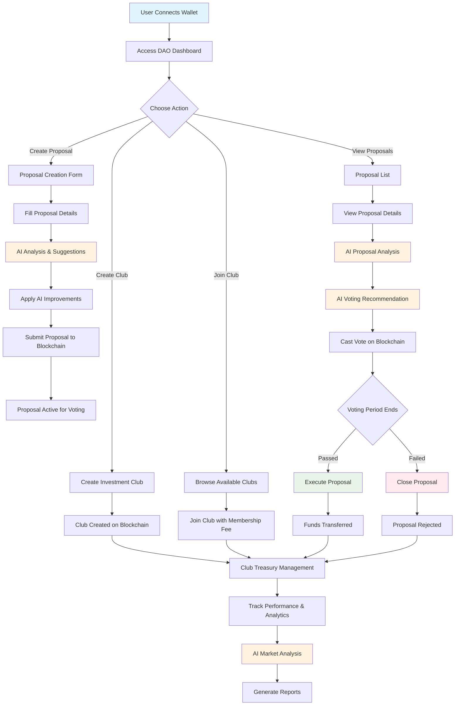

# 🤖 AI-Powered Treasury DAO

A decentralized autonomous organization (DAO) platform with integrated AI capabilities for intelligent governance, proposal analysis, and investment decision-making. Built on Conflux eSpace testnet with advanced AI features powered by OpenAI.


## 🎯 Live Demo

🌐 **Live Application**: https://treasury-dao-ai.vercel.app/

📱 **Testnet**: Conflux eSpace Testnet  
🔗 **Contract**: [View on ConfluxScan](https://evmtestnet.confluxscan.org/address/0x45E1E9ED173E47B4894ccCd3bCc9271522e6cfd2)

🎥 **Demo Video**:  https://youtu.be/TERyY8ot5uM

💻 **Original Repository**:  https://github.com/Vikash-8090-Yadav/TreasuryDaoAI


## 📊 Project Workflow



## 🌟 Features

### 🏛️ **Core DAO Functionality**
- **Club Management**: Create and join investment clubs
- **Proposal System**: Submit, vote on, and track proposals
- **Governance**: Decentralized decision-making with voting mechanisms
- **Treasury Management**: Secure fund allocation and tracking
- **Member Management**: Role-based access and permissions

### 🤖 **AI-Powered Features** ---->(New In this hackathon )

- **Smart Proposal Analysis**: AI evaluates proposals on 6 key criteria
- **Voting Recommendations**: AI suggests YES/NO/ABSTAIN with reasoning
- **Market Analysis**: Real-time market insights and trends
- **AI Chat Assistant**: Interactive support for DAO operations
- **Investment Analysis**: Risk assessment and investment recommendations
- **Predictive Analytics**: Success probability predictions

### 🔗 **Blockchain Integration**
- **Conflux eSpace Testnet**: Fast, secure, and energy-efficient
- **Smart Contracts**: Solidity-based club and proposal management
- **Web3 Integration**: Seamless wallet connection and transactions
- **On-chain Governance**: Transparent and immutable voting records

## 🚀 Quick Start

### Prerequisites
- Node.js (v14 or higher)
- npm or yarn
- MetaMask or compatible Web3 wallet
- Conflux testnet CFX tokens
- Hardhat (for smart contract deployment)

### Installation

1. **Clone the repository**
   ```bash
   git clone  https://github.com/Vikash-8090-Yadav/TreasuryDaoAI
   cd TreasuryDaoAI
   ```

2. **Install Frontend dependencies**
   ```bash
   cd Frontend
   npm install
   ```

3. **Install Smart Contract dependencies**
   ```bash
   cd Frontend/src/SmartContract
   npm install
   ```

4. **Set up environment variables**
   Create a `.env` file in the Frontend directory:
   ```env
   REACT_APP_OPENAI_API_KEY=your-openai-api-key-here
   ```

5. **Deploy Smart Contracts** (See Smart Contract Deployment section below)

6. **Start the development server**
   ```bash
   cd Frontend
   npm start
   ```

7. **Open your browser**
   Navigate to `http://localhost:3000`

## 🔧 Smart Contract Deployment

### Prerequisites for Smart Contract
- Node.js (v14 or higher)
- npm or yarn
- Conflux testnet CFX tokens for gas fees
- Hardhat installed globally: `npm install -g hardhat`

### Deployment Steps

1. **Navigate to Smart Contract directory**
   ```bash
   cd Frontend/src/SmartContract
   ```

2. **Install dependencies**
   ```bash
   npm install
   ```

3. **Configure Hardhat**
   The `hardhat.config.js` is already configured for Conflux eSpace testnet.

4. **Compile the contracts**
   ```bash
   npx hardhat compile
   ```

5. **Deploy to Conflux eSpace Testnet**
   ```bash
   npx hardhat run scripts/deploy.js --network confluxTestnet
   ```

6. **Update Frontend Configuration**
   After deployment, update the contract address in `Frontend/src/config.jsx`:
   ```javascript
   export const marketplaceAddress = "YOUR_DEPLOYED_CONTRACT_ADDRESS";
   ```

### Smart Contract Verification
```bash
npx hardhat verify --network confluxTestnet YOUR_CONTRACT_ADDRESS
```

### Testing Smart Contracts
```bash
npx hardhat test
```

## 🔧 Troubleshooting

### Common Issues

#### Smart Contract Deployment Issues
```bash
# If you get "insufficient funds" error
# Make sure you have enough CFX tokens in your wallet

# If you get "network not found" error
# Check your hardhat.config.js network configuration

# If deployment fails, try:
npx hardhat clean
npx hardhat compile
npx hardhat run scripts/deploy.js --network confluxTestnet
```

#### Frontend Issues
```bash
# If you get "AIProposalSuggestions is not defined" error
# Restart the development server:
npm start

# If AI features don't work
# Check your .env file has the correct OpenAI API key:
REACT_APP_OPENAI_API_KEY=your-actual-api-key-here

# Clear cache if needed:
rm -rf node_modules/.cache
npm start
```

#### Wallet Connection Issues
- Ensure MetaMask is installed and unlocked
- Switch to Conflux eSpace testnet
- Make sure you have testnet CFX tokens
- Try refreshing the page and reconnecting wallet


### 1. **Club Management**
- Create investment clubs with custom parameters
- Join existing clubs with membership requirements
- Manage club treasury and member roles
- Track club performance and statistics

### 2. **Proposal System**
- Submit investment proposals with detailed descriptions
- AI-powered proposal analysis and scoring
- Transparent voting mechanism with on-chain records
- Proposal lifecycle management (draft → active → executed)

### 3. **AI Analysis Engine**
- **Proposal Scoring**: 6-criteria evaluation system
  - Clarity & Detail (1-10)
  - Feasibility (1-10)
  - Risk Level (1-10)
  - Potential ROI (1-10)
  - Community Impact (1-10)
  - Innovation Factor (1-10)

- **Voting Recommendations**: AI suggests voting decisions with:
  - Clear YES/NO/ABSTAIN recommendations
  - Confidence levels (1-100%)
  - Detailed reasoning and analysis
  - Key factors, risks, and benefits

### 4. **Market Analysis**
- Real-time market insights and trends
- Top-performing asset tracking
- Risk assessment and recommendations
- Confidence scoring for all analyses

### 5. **AI Chat Assistant**
- Interactive support for DAO operations
- Context-aware responses
- Quick question templates
- Real-time assistance

## 🏗️ Technical Architecture

### Frontend Stack
- **React.js** - User interface framework
- **Bootstrap** - CSS framework for responsive design
- **Web3.js** - Blockchain interaction
- **Ethers.js** - Ethereum/Conflux wallet integration
- **Axios** - HTTP client for API calls
- **React Toastify** - User notifications

### Smart Contract Stack
- **Solidity** - Smart contract programming language
- **Hardhat** - Development environment and testing framework
- **Conflux eSpace** - EVM-compatible blockchain network

### AI Integration
- **OpenAI GPT-3.5-turbo** - Natural language processing
- **Custom AI Service** - Proposal analysis and recommendations
- **RESTful API** - AI service communication

### Database & Storage
- **IPFS** - Decentralized file storage for proposal documents
- **Blockchain** - On-chain data storage for proposals and votes
- **Local Storage** - Client-side data persistence

## 🔧 Smart Contract Details

### InvestmentClub Contract
- **Club Management**: Create, join, and manage investment clubs
- **Proposal System**: Submit, vote on, and execute proposals
- **Treasury Management**: Secure fund allocation and tracking
- **Governance**: Decentralized decision-making mechanisms

### Key Functions
```solidity
// Core Club Functions
function createClub(string memory name) external
function joinClub(uint256 clubId) external payable
function leaveClub(uint256 clubId) external

// Proposal Functions
function createProposal(uint256 clubId, uint256 amount, address destination, string memory description, string memory cid) external
function voteOnProposal(uint256 clubId, uint256 proposalId, bool inSupport) external
function executeProposal(uint256 clubId, uint256 proposalId) external
function closeProposal(uint256 clubId, uint256 proposalId) external
```


## 🤖 AI Features

### Proposal Analysis
The AI analyzes proposals across multiple dimensions:

```json
{
  "clarity": 8,
  "feasibility": 7,
  "riskLevel": 4,
  "potentialROI": 9,
  "communityImpact": 8,
  "innovation": 6,
  "overallScore": 78,
  "strengths": ["Clear objectives", "Detailed plan"],
  "weaknesses": ["High risk", "Unclear timeline"],
  "recommendations": ["Add timeline details", "Include risk mitigation"]
}
```

### Voting Recommendations
AI provides intelligent voting guidance:

```json
{
  "recommendation": "YES",
  "confidence": 85,
  "reasoning": "This proposal shows strong potential with clear objectives...",
  "keyFactors": ["Clear implementation roadmap", "Community impact potential"],
  "risks": ["Market volatility impact", "Implementation timeline risks"],
  "benefits": ["Potential treasury growth", "Community engagement boost"]
}
```


## 📄 License

This project is licensed under the MIT License - see the [LICENSE](LICENSE) file for details.


## 🎯 Roadmap

### Phase 1 (Completed) ✅
- ✅ Basic DAO functionality
- ✅ AI proposal analysis with 6-criteria scoring
- ✅ AI voting recommendations with confidence levels
- ✅ Conflux eSpace testnet integration
- ✅ Smart contract deployment and verification
- ✅ AI-powered proposal improvement suggestions
- ✅ Real-time proposal content generation
- ✅ Interactive AI chat assistant
- ✅ Market analysis dashboard

### Phase 2 (In Progress) 🔄
- 🔄 Advanced AI features (sentiment analysis, proposal similarity detection)
- 🔄 Mobile-responsive design optimization
- 🔄 Multi-signature wallet integration
- 🔄 Enhanced analytics and reporting
- 🔄 Proposal discussion threads
- 🔄 Member reputation system

### Phase 3 (Planned) 📋
- 📋 Governance token integration
- 📋 Advanced DeFi protocol integration
- 📋 Multi-chain support (Ethereum, Polygon, BSC)
- 📋 Cross-chain proposal execution
- 📋 Enterprise-grade security features
- 📋 Advanced treasury management tools

### Phase 4 (Future) 🚀
- 🚀 Mobile app (React Native)
- 🚀 AI-powered automated execution
- 🚀 Advanced predictive analytics
- 🚀 Integration with major DeFi protocols
- 🚀 Cross-DAO collaboration features

#

**Built with ❤️ for the decentralized future**

**Powered by AI and Conflux eSpace testnet**

*This project was created for hackathon purposes and demonstrates the potential of AI-powered DAO governance.*
