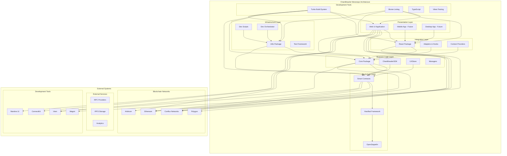

# ChainBrawler Monorepo Architecture

## System Overview

ChainBrawler is a comprehensive blockchain RPG ecosystem built as a modern monorepo. The architecture follows a layered approach with clear separation of concerns, enabling independent development while maintaining tight integration between components.

## High-Level Architecture



## Package Architecture

### 1. **@chainbrawler/contract** - Smart Contract Layer

**Purpose**: Blockchain game logic and smart contract implementation

**Architecture:**
```
contracts/
├── ChainBrawlerClean.sol          # Main game contract
├── CombatEngine.sol               # Combat system logic
├── LeaderboardManager.sol         # Leaderboard management
├── LeaderboardTreasury.sol        # Treasury and rewards
├── StructuralTypes.sol            # Shared data structures
├── CombatStructs.sol              # Combat-specific types
├── CombatConfig.sol               # Combat configuration
├── CombatMath.sol                 # Mathematical utilities
├── BitPackedCharacterLib.sol      # Character data optimization
├── SafePacker.sol                 # Safe data packing
├── Errors.sol                     # Custom error definitions
├── IChainBrawlerUI.sol            # UI interface
├── interfaces/                    # Contract interfaces
└── libraries/                     # Utility libraries
```

**Key Design Patterns:**
- **Modular Design**: Separate contracts for different game systems
- **Library Pattern**: Reusable utility libraries
- **Interface Segregation**: Clean interfaces for different functionalities
- **Gas Optimization**: Bit-packing and efficient storage
- **Security First**: Access control and reentrancy protection

**Dependencies:**
- OpenZeppelin contracts for security
- Hardhat for development and testing
- Viem for testing and deployment

### 2. **@chainbrawler/core** - Business Logic Layer

**Purpose**: Environment-agnostic business logic and SDK

**Architecture:**
```
src/
├── ChainBrawlerSDK.ts             # Main SDK orchestrator
├── state/
│   └── UXStore.ts                 # Centralized state management
├── managers/
│   ├── CharacterManager.ts        # Character operations
│   ├── CombatManager.ts           # Combat operations
│   ├── PoolManager.ts             # Treasury operations
│   ├── LeaderboardManager.ts      # Leaderboard operations
│   └── ClaimsManager.ts           # Claims operations
├── operations/
│   ├── CharacterOperations.ts     # Character business logic
│   ├── CombatOperations.ts        # Combat business logic
│   ├── PoolOperations.ts          # Pool business logic
│   ├── LeaderboardOperations.ts   # Leaderboard business logic
│   └── ClaimsOperations.ts        # Claims business logic
├── contract/
│   ├── ContractClient.ts          # Contract interaction interface
│   └── WagmiContractClient.ts     # Wagmi-specific implementation
├── events/
│   └── EventManager.ts            # Event handling
├── types/
│   └── index.ts                   # Type definitions
├── utils/
│   └── index.ts                   # Utility functions
└── validation/
    └── index.ts                   # Data validation
```

**Key Design Patterns:**
- **SDK Pattern**: Central orchestrator for all operations
- **Manager Pattern**: Separate managers for different domains
- **State Management**: Centralized state with Zustand
- **Event-Driven**: Event-based communication
- **Type Safety**: Comprehensive TypeScript types

**Dependencies:**
- Viem for blockchain interaction
- Zustand for state management
- Generated types from smart contracts

### 3. **@chainbrawler/react** - Integration Layer

**Purpose**: React-specific adapters and components

**Architecture:**
```
src/
├── adapters/
│   ├── ReactAdapter.ts            # Generic React adapter
│   └── WebAdapter.ts              # Web-specific adapter
├── providers/
│   ├── ChainBrawlerProvider.tsx   # Generic provider
│   └── WebChainBrawlerProvider.tsx # Web-specific provider
├── hooks/
│   ├── useChainBrawler.ts         # Main hook
│   ├── useUXState.ts              # State hook
│   ├── useClaims.ts               # Claims hook
│   ├── usePools.ts                # Pools hook
│   ├── useLeaderboard.ts          # Leaderboard hook
│   ├── useWebChainBrawler.ts      # Web-specific hook
│   ├── useWebClaims.ts            # Web claims hook
│   ├── useWebPools.ts             # Web pools hook
│   └── useWebLeaderboard.ts       # Web leaderboard hook
├── components/
│   └── index.ts                   # Re-export components
└── ui/
    └── index.ts                   # UI components
```

**Key Design Patterns:**
- **Adapter Pattern**: Generic and specific adapters
- **Provider Pattern**: Context-based state sharing
- **Hook Pattern**: Custom hooks for logic
- **Composition**: Composable components

**Dependencies:**
- @chainbrawler/core for business logic
- React 18 for UI framework
- Wagmi for blockchain integration

### 4. **@chainbrawler/web-ui** - Presentation Layer

**Purpose**: Complete web application frontend

**Architecture:**
```
src/
├── App.tsx                        # Main application
├── main.tsx                       # Application entry
├── app/
│   ├── config/
│   │   └── wagmi.ts              # Wagmi configuration
│   └── providers/
│       └── ChainBrawlerProvider.tsx # App-specific provider
├── features/
│   ├── character/                 # Character management
│   ├── combat/                    # Combat system
│   ├── game/                      # Main game interface
│   ├── pools/                     # Treasury system
│   ├── leaderboard/               # Leaderboard system
│   ├── claims/                    # Claims system
│   ├── history/                   # Transaction history
│   └── transactions/              # Transaction management
├── components/
│   ├── game/                      # Game-specific components
│   ├── navigation/                # Navigation components
│   ├── wallet/                    # Wallet components
│   └── ui/                        # Reusable UI components
├── hooks/
│   └── useAppState.ts             # Application state
├── config/
│   ├── chains.ts                  # Chain configuration
│   ├── wagmi.ts                   # Wagmi setup
│   └── connectors.ts              # Wallet connectors
├── theme/
│   ├── index.ts                   # Theme configuration
│   └── tokens.ts                  # Design tokens
└── utils/
    └── index.ts                   # Utility functions
```

**Key Design Patterns:**
- **Feature-Driven**: Organized by game features
- **Component Composition**: Reusable components
- **Theme System**: Comprehensive design system
- **Responsive Design**: Mobile-first approach

**Dependencies:**
- @chainbrawler/react for integration
- @chainbrawler/core for business logic
- Mantine for UI components
- ConnectKit for wallet connection
- Vite for build system

### 5. **@chainbrawler/utils** - Infrastructure Layer

**Purpose**: Development tools and utilities

**Architecture:**
```
src/
├── scripts/
│   ├── dev-orchestrator.ts        # Development orchestrator
│   └── test-runner.ts             # Test runner
├── orchestrator/
│   ├── DevOrchestrator.ts         # Development coordination
│   └── TestRunner.ts              # Test coordination
├── chain/
│   ├── chainConfig.ts             # Chain configuration
│   └── addressManager.ts          # Address management
├── conflux/
│   └── confluxUtils.ts            # Conflux-specific utilities
├── contracts/
│   └── contractUtils.ts           # Contract utilities
├── logging/
│   └── logger.ts                  # Logging system
└── testing/
    └── testUtils.ts               # Testing utilities
```

**Key Design Patterns:**
- **Orchestrator Pattern**: Coordination of development tasks
- **Utility Pattern**: Reusable utility functions
- **Configuration Management**: Centralized configuration
- **Logging System**: Structured logging

**Dependencies:**
- @chainbrawler/core for integration
- Node.js for runtime
- Pino for logging

## Data Flow Architecture

### 1. **User Interaction Flow**
```
User Action → Web UI → React Hook → Core SDK → Contract Client → Smart Contract → Blockchain
                ↓
            State Update → Context → Component → UI Re-render → User Feedback
```

### 2. **Blockchain Event Flow**
```
Blockchain Event → Smart Contract → Contract Client → Core SDK → State Store → React Hook → Component → UI Update
```

### 3. **Development Flow**
```
Code Change → TypeScript Compiler → Build System → Test Runner → Package Manager → Deployment
```

### 4. **State Management Flow**
```
User Action → Hook → Manager → Operation → State Update → Store → Context → Component → UI
```

## Package Dependencies

### Dependency Graph
```
@chainbrawler/web-ui
├── @chainbrawler/react
│   └── @chainbrawler/core
│       └── viem
├── @chainbrawler/core
│   └── viem
├── react
├── react-dom
├── @mantine/core
├── connectkit
└── wagmi

@chainbrawler/react
├── @chainbrawler/core
│   └── viem
├── react
├── react-dom
└── @wagmi/core

@chainbrawler/core
├── viem
└── zustand

@chainbrawler/contract
├── @openzeppelin/contracts
├── hardhat
└── viem

@chainbrawler/utils
├── @chainbrawler/core
│   └── viem
├── pino
└── viem
```

### Internal Dependencies
- **Web UI** → **React** → **Core**
- **React** → **Core**
- **Utils** → **Core**
- **Utils** → **Contract** (for development)

### External Dependencies
- **Viem**: Blockchain interaction
- **Wagmi**: React blockchain hooks
- **ConnectKit**: Wallet connection UI
- **Mantine**: UI components
- **Hardhat**: Smart contract development
- **OpenZeppelin**: Smart contract security

## Development Architecture

### Build System
- **Turbo**: Monorepo build orchestration
- **TypeScript**: Type checking and compilation
- **Vite**: Web application bundling
- **Hardhat**: Smart contract compilation

### Testing Strategy
- **Unit Tests**: Individual package testing
- **Integration Tests**: Cross-package testing
- **E2E Tests**: Complete user flow testing
- **Contract Tests**: Smart contract testing

### Code Quality
- **Biome**: Linting and formatting
- **TypeScript**: Type safety
- **Vitest**: Testing framework
- **Playwright**: E2E testing

### Development Workflow
1. **Code Changes**: TypeScript compilation
2. **Testing**: Automated test execution
3. **Linting**: Code quality checks
4. **Building**: Package compilation
5. **Deployment**: Package distribution

## Deployment Architecture

### Smart Contract Deployment
```
Development → Testing → Staging → Production
     ↓           ↓         ↓         ↓
  Localhost → Testnet → Testnet → Mainnet
```

### Web Application Deployment
```
Development → Build → Static Hosting → CDN
     ↓          ↓         ↓           ↓
   Vite → Production → Netlify/Vercel → Global
```

### Package Distribution
```
Build → Package → Publish → Install
  ↓        ↓         ↓        ↓
TypeScript → NPM → Registry → Projects
```

## Security Architecture

### Smart Contract Security
- **Access Control**: Role-based permissions
- **Reentrancy Protection**: Guard against attacks
- **Input Validation**: Comprehensive validation
- **Gas Optimization**: Efficient operations

### Application Security
- **Wallet Security**: Secure wallet integration
- **Input Sanitization**: XSS prevention
- **HTTPS Enforcement**: Secure communication
- **Environment Variables**: Secure configuration

### Development Security
- **Dependency Scanning**: Vulnerability detection
- **Code Review**: Peer review process
- **Testing**: Comprehensive test coverage
- **Documentation**: Security guidelines

## Performance Architecture

### Smart Contract Performance
- **Gas Optimization**: Efficient operations
- **Storage Optimization**: Minimal storage usage
- **Batch Operations**: Reduced transaction costs
- **Caching**: On-chain caching strategies

### Application Performance
- **Code Splitting**: Lazy loading
- **Bundle Optimization**: Minimal bundle size
- **Caching**: Smart caching strategies
- **CDN**: Global content delivery

### Development Performance
- **Hot Reloading**: Fast development
- **Incremental Builds**: Only rebuild changed packages
- **Parallel Testing**: Concurrent test execution
- **Caching**: Build and test caching

## Monitoring and Observability

### Application Monitoring
- **Performance Metrics**: Load times, bundle size
- **Error Tracking**: Exception monitoring
- **User Analytics**: Usage patterns
- **Blockchain Metrics**: Transaction success rates

### Development Monitoring
- **Build Metrics**: Build times, success rates
- **Test Metrics**: Coverage, execution times
- **Code Quality**: Linting, formatting
- **Dependency Health**: Security, updates

## Future Architecture Considerations

### Scalability
- **Microservices**: Potential service separation
- **Database Integration**: Off-chain data storage
- **Caching Layers**: Multi-level caching
- **CDN Integration**: Global content delivery

### Extensibility
- **Plugin System**: Extensible architecture
- **API Gateway**: Centralized API management
- **Event Streaming**: Real-time event processing
- **Multi-chain**: Cross-chain compatibility

### Maintainability
- **Documentation**: Comprehensive documentation
- **Testing**: Extensive test coverage
- **Code Quality**: Consistent standards
- **Monitoring**: Proactive monitoring
