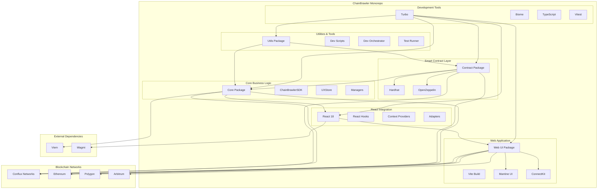

# ChainBrawler

**The Ultimate Blockchain RPG Experience - Complete Monorepo**

ChainBrawler is a comprehensive blockchain-based RPG game built on modern web3 technologies. This monorepo contains all the components needed to run a complete blockchain gaming ecosystem, from smart contracts to web applications.

## 🏗️ Monorepo Architecture



## 📦 Package Overview

### 🎮 **@chainbrawler/contract** - Smart Contracts
**Purpose**: Blockchain game logic and smart contract implementation

**Key Features:**
- Complete RPG game mechanics on-chain
- Character creation and management
- Combat system with deterministic outcomes
- Treasury and leaderboard systems
- Prize distribution with Merkle proofs
- Gas optimization and security features

**Technologies:**
- Solidity 0.8.19
- Hardhat development framework
- OpenZeppelin contracts
- Viem for testing and deployment

### 🧠 **@chainbrawler/core** - Core Business Logic
**Purpose**: Environment-agnostic business logic and SDK

**Key Features:**
- ChainBrawlerSDK - Main orchestrator
- UXStore - Centralized state management
- Contract clients and managers
- Event handling and operations
- Type-safe API with comprehensive types

**Technologies:**
- TypeScript
- Viem for blockchain interaction
- Zustand for state management
- Comprehensive testing with Vitest

### ⚛️ **@chainbrawler/react** - React Integration
**Purpose**: React-specific adapters and components

**Key Features:**
- React hooks for easy integration
- Context providers for state sharing
- Generic and web-specific adapters
- Type-safe React components
- Comprehensive testing with React Testing Library

**Technologies:**
- React 18 with TypeScript
- React Router for navigation
- Wagmi integration
- Vitest for testing

### 🌐 **@chainbrawler/web-ui** - Web Application
**Purpose**: Complete web application frontend

**Key Features:**
- Full-featured React application
- Beautiful dark theme with game aesthetics
- Wallet integration with ConnectKit
- Multi-chain support
- Responsive design for all devices
- Complete game interface

**Technologies:**
- React 18 with Vite
- Mantine UI components
- ConnectKit for wallet connection
- Playwright for E2E testing

### 🛠️ **@chainbrawler/utils** - Utilities & Tools
**Purpose**: Development tools and utilities

**Key Features:**
- Development orchestrator
- Test runner with comprehensive coverage
- Chain configuration utilities
- Logging and debugging tools
- Deployment scripts

**Technologies:**
- TypeScript with Node.js
- Pino for logging
- Comprehensive testing utilities

## 🚀 Quick Start

### Prerequisites
- Node.js 18+
- pnpm 9.1.0+
- Git

### Installation
```bash
# Clone the repository
git clone https://github.com/chainbrawler/chainbrawler.git
cd chainbrawler

# Install dependencies
pnpm install

# Build all packages
pnpm build
```

### Development
```bash
# Start development environment
pnpm dev

# Start web application only
pnpm web

# Run tests
pnpm test

# Run specific package tests
pnpm test:contract
pnpm test:core
pnpm test:react
pnpm test:utils
pnpm test:web-ui
```

### Production Build
```bash
# Build all packages
pnpm build

# Start web application
cd packages/web-ui
pnpm preview
```

## 🎮 Game Features

### Character System
- **4 Character Classes**: Warrior, Mage, Rogue, Paladin
- **Stat Progression**: Combat, Defense, Luck, Health
- **Equipment System**: Weapons, armor, and accessories
- **Level System**: XP-based progression with stat growth

### Combat System
- **Enemy Selection**: Choose from various enemies and difficulty levels
- **Deterministic Combat**: Fair and predictable combat outcomes
- **Critical Hits**: Luck-based critical hit system
- **Equipment Drops**: Rewards based on enemy difficulty

### Treasury System
- **Pool Management**: Multiple treasury pools for different purposes
- **Real-time Updates**: Live pool value tracking
- **Fee Distribution**: Automated fee distribution system

### Leaderboard System
- **Player Rankings**: Competitive leaderboard system
- **Epoch Management**: Time-based ranking periods
- **Prize Distribution**: Merkle-based prize claiming

### Claims System
- **Prize Claims**: Secure prize claiming with Merkle proofs
- **Claim History**: Track claimable and claimed prizes
- **Proof Verification**: Cryptographic proof verification

## 🏗️ Architecture Principles

### 1. **Modular Design**
- Clear separation of concerns
- Reusable components and utilities
- Independent package development
- Loose coupling between packages

### 2. **Type Safety**
- Comprehensive TypeScript coverage
- Generated types from smart contracts
- Type-safe API interfaces
- Runtime type validation

### 3. **Performance Optimization**
- Efficient state management
- Code splitting and lazy loading
- Gas-optimized smart contracts
- Caching and rate limiting

### 4. **Developer Experience**
- Hot reloading and fast builds
- Comprehensive testing
- Clear documentation
- Easy development setup

### 5. **Security First**
- Smart contract security audits
- Input validation and sanitization
- Secure wallet integration
- Best practices throughout

## 🔧 Development Workflow

### Package Development
```bash
# Work on specific package
cd packages/core
pnpm dev

# Run package tests
pnpm test

# Build package
pnpm build
```

### Monorepo Management
```bash
# Run all tests
pnpm test

# Format all code
pnpm format

# Lint all packages
pnpm lint

# Build all packages
pnpm build
```

### Smart Contract Development
```bash
# Start local blockchain
cd packages/contract
pnpm dev

# Run tests
pnpm test

# Deploy contracts
pnpm hardhat ignition deploy ./ignition/modules/ChainBrawlerModule.ts --network localhost
```

## 📊 Testing Strategy

### Unit Tests
- **Core Package**: Business logic and SDK testing
- **React Package**: Hook and component testing
- **Utils Package**: Utility function testing
- **Contract Package**: Smart contract testing

### Integration Tests
- **End-to-End**: Complete user flows
- **Cross-Package**: Package integration testing
- **Blockchain**: Smart contract interaction testing

### Test Coverage
- **Core**: 95%+ coverage
- **React**: 90%+ coverage
- **Utils**: 85%+ coverage
- **Contract**: 90%+ coverage

## 🚀 Deployment

### Smart Contracts
```bash
# Deploy to Conflux Testnet
cd packages/contract
pnpm hardhat ignition deploy ./ignition/modules/ChainBrawlerModule.ts --network confluxTestnet

# Deploy to Conflux Mainnet
pnpm hardhat ignition deploy ./ignition/modules/ChainBrawlerModule.ts --network confluxMainnet
```

### Web Application
```bash
# Build for production
cd packages/web-ui
pnpm build

# Deploy to static hosting
pnpm preview
```

### Docker Deployment
```bash
# Build Docker image
cd packages/web-ui
docker build -t chainbrawler-web .

# Run with Docker Compose
docker-compose up
```

## 🔗 Supported Networks

### Primary Networks
- **Conflux Local**: Development (ID: 2030)
- **Conflux Testnet**: Testing (ID: 71)
- **Conflux Mainnet**: Production (ID: 1030)

### Additional Networks
- **Ethereum Mainnet**: Cross-chain support
- **Polygon**: Layer 2 scaling
- **Arbitrum**: Layer 2 scaling

## 📚 Documentation

Each package contains comprehensive documentation:

- **[Core Package](packages/core/README.md)** - Business logic and SDK
- **[React Package](packages/react/README.md)** - React integration
- **[Contract Package](packages/contract/README.md)** - Smart contracts
- **[Web UI Package](packages/web-ui/README.md)** - Web application
- **[Utils Package](packages/utils/README.md)** - Development tools

## 🤝 Contributing

### Development Setup
1. Fork the repository
2. Create a feature branch
3. Make your changes
4. Add tests
5. Submit a pull request

### Code Standards
- TypeScript for all packages
- Biome for formatting and linting
- Comprehensive testing
- Clear documentation

### Pull Request Process
1. Ensure all tests pass
2. Update documentation
3. Add appropriate tests
4. Request review from maintainers

## 📄 License

Apache-2.0 - see [LICENSE](LICENSE) for details.

## 🆘 Support

- **Documentation**: Check package-specific README files
- **Issues**: Open an issue in the repository
- **Discussions**: Use GitHub Discussions for questions
- **Discord**: Join our community Discord

## 🗺️ Roadmap

### Phase 1: Core Foundation ✅
- Smart contract development
- Core SDK implementation
- React integration
- Web application

### Phase 2: Enhanced Features 🚧
- Advanced combat mechanics
- Equipment system expansion
- Guild system
- Tournament mode

### Phase 3: Ecosystem Growth 📋
- Mobile application
- Cross-chain expansion
- NFT integration
- Community features

## 📈 Performance Metrics

### Smart Contracts
- **Gas Efficiency**: Optimized for low gas costs
- **Security**: Comprehensive security measures
- **Scalability**: Designed for high throughput

### Web Application
- **Bundle Size**: ~500KB production build
- **Load Time**: < 2 seconds initial load
- **Performance**: 90+ Lighthouse score

### Development Experience
- **Build Time**: < 30 seconds full build
- **Test Coverage**: 90%+ across all packages
- **Hot Reload**: < 1 second for changes

---

**ChainBrawler** - Where blockchain meets RPG gaming! 🎮⚔️
