# ChainBrawler Contract Architecture

## System Overview

The ChainBrawler contract package implements a complete on-chain RPG system with gas-optimized smart contracts. It follows a modular architecture with clear separation of concerns, focusing on security, efficiency, and maintainability.

## Architecture Diagram

```mermaid
graph TB
    subgraph "Smart Contract Layer"
        subgraph "Main Game Contract"
            ChainBrawler[ChainBrawlerClean]
            State[ChainBrawlerState]
            Combat[CombatEngine]
        end
        
        subgraph "Leaderboard System"
            Manager[LeaderboardManager]
            Treasury[LeaderboardTreasury]
        end
        
        subgraph "Core Libraries"
            BitPacked[BitPackedCharacterLib]
            CombatMath[CombatMath]
            SafePacker[SafePacker]
            CombatEngineLib[CombatEngineLib]
        end
        
        subgraph "Configuration & Types"
            CombatConfig[CombatConfig]
            StructuralTypes[StructuralTypes]
            CombatStructs[CombatStructs]
            Errors[Errors]
        end
        
        subgraph "Interfaces"
            UI[IChainBrawlerUI]
            TreasuryInfo[ITreasuryInfo]
            LeaderboardInfo[ILeaderboardInfo]
            CharacterValidation[ICharacterValidation]
        end
    end
    
    subgraph "External Dependencies"
        OpenZeppelin[OpenZeppelin Contracts]
        Viem[Viem]
        Hardhat[Hardhat]
    end
    
    subgraph "Deployment & Testing"
        Ignition[Hardhat Ignition]
        Tests[Test Suite]
        Scripts[Deployment Scripts]
    end
    
    %% Main connections
    ChainBrawler --> State
    ChainBrawler --> Combat
    ChainBrawler --> Manager
    ChainBrawler --> Treasury
    
    Manager --> Treasury
    
    ChainBrawler --> BitPacked
    ChainBrawler --> CombatMath
    ChainBrawler --> SafePacker
    Combat --> CombatEngineLib
    
    ChainBrawler --> CombatConfig
    ChainBrawler --> StructuralTypes
    ChainBrawler --> CombatStructs
    ChainBrawler --> Errors
    
    ChainBrawler --> UI
    ChainBrawler --> TreasuryInfo
    ChainBrawler --> LeaderboardInfo
    ChainBrawler --> CharacterValidation
    
    ChainBrawler --> OpenZeppelin
    Manager --> OpenZeppelin
    Treasury --> OpenZeppelin
    
    Ignition --> ChainBrawler
    Ignition --> Manager
    Ignition --> Treasury
    
    Tests --> ChainBrawler
    Tests --> Manager
    Tests --> Treasury
```



## Contract Responsibilities

### 1. ChainBrawlerClean (Main Contract)
**Purpose**: Central orchestrator for all game functionality

**Responsibilities**:
- Character creation and management
- Combat system coordination
- Fee collection and distribution
- Leaderboard integration
- Event emission for UI updates
- Access control and security

**Key Functions**:
- `createCharacter(uint256 classId)`: Create new character
- `fightEnemy(uint256 enemyId, uint256 enemyLevel)`: Start combat
- `healCharacter()`: Heal character for fee
- `resurrectCharacter()`: Resurrect dead character
- `getCharacter(address player)`: Get character data
- `getCombatState(address player)`: Get combat state

### 2. ChainBrawlerState (State Management)
**Purpose**: Manages all game state and character data

**Responsibilities**:
- Character data storage and retrieval
- Combat state persistence
- Game configuration management
- Event emission for state changes

**Key Storage**:
- `mapping(address => BitPackedCharacter) characters`: Character data
- `mapping(address => CombatState) combatStates`: Combat state
- `mapping(uint256 => EnemyData) enemies`: Enemy configurations
- `mapping(uint256 => uint256) xpRequiredForLevel`: XP requirements

### 3. CombatEngine (Combat System)
**Purpose**: Implements deterministic combat mechanics

**Responsibilities**:
- Combat calculation and execution
- Combat state management
- Enemy stat scaling
- Equipment drop logic
- XP and level progression

**Key Functions**:
- `fightEnemy(uint256 enemyId, uint256 enemyLevel)`: Execute combat
- `continueFight()`: Resume paused combat
- `fleeRound()`: Attempt to flee combat
- `getScaledEnemyStats(uint256 enemyId, uint256 enemyLevel)`: Get enemy stats

### 4. LeaderboardManager (Leaderboard Management)
**Purpose**: Manages leaderboard operations and reward distribution

**Responsibilities**:
- Leaderboard result publishing
- Reward distribution coordination
- Epoch management
- Access control for leaderboard operations

**Key Functions**:
- `publishLeaderboard(bytes32 root, uint256 epoch, uint256 totalRewards)`: Publish results
- `distributeRewards(address[] winners, uint256[] amounts)`: Distribute rewards

### 5. LeaderboardTreasury (Reward Treasury)
**Purpose**: Handles prize distribution and Merkle-based claims

**Responsibilities**:
- Fund management and security
- Merkle proof verification
- Claim processing
- Epoch-based reward distribution

**Key Functions**:
- `deposit()`: Deposit funds to treasury
- `publishEpochRoot(uint256 epoch, bytes32 root)`: Publish epoch root
- `claimPrize(uint256 epoch, uint256 index, uint256 amount, bytes32[] proof)`: Claim prize
- `isClaimed(uint256 epoch, uint256 index)`: Check claim status

## Data Flow Patterns

### 1. Character Creation Flow
```
User → createCharacter() → ChainBrawlerClean → ChainBrawlerState → CharacterCreated Event
```

### 2. Combat Flow
```
User → fightEnemy() → CombatEngine → CombatState → FightStarted Event
CombatEngine → CombatResult → ChainBrawlerState → FightCompleted Event
```

### 3. Leaderboard Flow
```
Manager → publishLeaderboard() → LeaderboardManager → LeaderboardTreasury
User → claimPrize() → LeaderboardTreasury → MerkleProof → PrizeClaimed Event
```

## Key Design Patterns

### 1. **Modular Architecture**
- Clear separation of concerns
- Library-based code reuse
- Interface-based contracts
- Composable functionality

### 2. **Gas Optimization**
- Bit-packed data structures
- Efficient storage patterns
- Library-based calculations
- Minimal external calls

### 3. **Security First**
- Access control with OpenZeppelin
- Reentrancy protection
- Input validation
- Emergency pause functionality

### 4. **Event-Driven Design**
- Comprehensive event emission
- UI-friendly event data
- State change notifications
- Debug and monitoring support

## Storage Optimization

### 1. **Bit-Packed Character Data**
```solidity
struct BitPackedCharacter {
    uint256 packed; // All character data in one slot
}
```

**Packed Data**:
- Level (8 bits)
- Experience (32 bits)
- Endurance (16 bits)
- Max Endurance (16 bits)
- Combat (16 bits)
- Defense (16 bits)
- Luck (16 bits)
- Class (8 bits)
- Flags (8 bits)

### 2. **Efficient Mappings**
- Single slot per character
- Optimized data access
- Minimal storage reads/writes
- Gas-efficient operations

### 3. **Library-Based Calculations**
- Reusable code
- Reduced contract size
- Efficient computation
- Gas optimization

## Security Considerations

### 1. **Access Control**
- Role-based permissions
- Admin function protection
- Emergency pause capability
- Upgradeable patterns

### 2. **Reentrancy Protection**
- OpenZeppelin ReentrancyGuard
- State updates before external calls
- Safe external call patterns
- Comprehensive protection

### 3. **Input Validation**
- Bounds checking
- Type validation
- Custom error messages
- Fail-safe defaults

### 4. **Economic Security**
- Fee validation
- Overflow protection
- Underflow protection
- Safe math operations

## Gas Optimization Strategies

### 1. **Storage Optimization**
- Bit-packed data structures
- Efficient mapping patterns
- Minimal storage operations
- Single slot per entity

### 2. **Computation Optimization**
- Library-based calculations
- Efficient algorithms
- Minimal external calls
- Optimized loops

### 3. **Contract Size Optimization**
- Solidity optimizer (runs: 1)
- Library separation
- Code reuse patterns
- Minimal inheritance

## Testing Strategy

### 1. **Unit Tests**
- Individual contract testing
- Function-level validation
- Edge case coverage
- Gas consumption analysis

### 2. **Integration Tests**
- End-to-end game flows
- Contract interaction testing
- State consistency validation
- Event emission testing

### 3. **Security Tests**
- Access control validation
- Reentrancy protection testing
- Input validation testing
- Economic attack simulation

### 4. **Gas Tests**
- Gas consumption analysis
- Optimization validation
- Cost-benefit analysis
- Performance benchmarking

## Deployment Architecture

### 1. **Deployment Order**
1. CombatEngineLib (library)
2. ChainBrawlerClean (main contract)
3. LeaderboardTreasury (treasury)
4. LeaderboardManager (manager)

### 2. **Configuration**
- Library linking
- Role assignment
- Address configuration
- Initial state setup

### 3. **Verification**
- Contract verification
- ABI generation
- Address registration
- Documentation update

## Integration Points

### 1. **With Core Package**
- Contract addresses
- ABI definitions
- Event interfaces
- Type definitions

### 2. **With React Package**
- UI-friendly interfaces
- Event handling
- State synchronization
- User interaction

### 3. **With Utils Package**
- Address management
- Chain configuration
- Deployment utilities
- Development tools

## Future Extensibility

### 1. **New Game Features**
- Modular contract design
- Interface-based extensions
- Library-based functionality
- Upgradeable patterns

### 2. **New Contract Types**
- Interface compliance
- Event emission
- State management
- Security patterns

### 3. **New Networks**
- Network configuration
- Address management
- Deployment scripts
- Verification tools

## Performance Metrics

### 1. **Gas Costs**
- Character Creation: ~200,000 gas
- Fight Enemy: ~150,000 gas
- Heal Character: ~100,000 gas
- Resurrect Character: ~120,000 gas

### 2. **Storage Efficiency**
- 1 slot per character
- Efficient data packing
- Minimal storage operations
- Optimized access patterns

### 3. **Computation Efficiency**
- Library-based calculations
- Efficient algorithms
- Minimal external calls
- Optimized loops

## Monitoring and Maintenance

### 1. **Event Monitoring**
- Comprehensive event emission
- State change tracking
- Error monitoring
- Performance metrics

### 2. **Security Monitoring**
- Access control validation
- Reentrancy protection
- Input validation
- Economic security

### 3. **Performance Monitoring**
- Gas consumption tracking
- Storage efficiency
- Computation performance
- Network performance
