# @chainbrawler/contract

**ChainBrawler Smart Contracts - On-chain game logic and state management**

The `@chainbrawler/contract` package contains all the smart contracts that power the ChainBrawler game on the blockchain. It implements a complete on-chain RPG system with character management, combat mechanics, leaderboards, and reward distribution.

## 🏗️ Architecture Overview

The contract package follows a modular, gas-optimized architecture with clear separation of concerns:

```mermaid
graph TB
    subgraph "Smart Contract Architecture"
        subgraph "Main Game Contract"
            ChainBrawler[ChainBrawlerClean]
            State[ChainBrawlerState]
            Combat[CombatEngine]
        end
        
        subgraph "Leaderboard System"
            Manager[LeaderboardManager]
            Treasury[LeaderboardTreasury]
        end
        
        subgraph "Core Libraries"
            BitPacked[BitPackedCharacterLib]
            CombatMath[CombatMath]
            SafePacker[SafePacker]
            CombatEngineLib[CombatEngineLib]
        end
        
        subgraph "Configuration & Types"
            CombatConfig[CombatConfig]
            StructuralTypes[StructuralTypes]
            CombatStructs[CombatStructs]
            Errors[Errors]
        end
        
        subgraph "Interfaces"
            UI[IChainBrawlerUI]
            TreasuryInfo[ITreasuryInfo]
            LeaderboardInfo[ILeaderboardInfo]
            CharacterValidation[ICharacterValidation]
        end
    end
    
    subgraph "External Dependencies"
        OpenZeppelin[OpenZeppelin Contracts]
        Viem[Viem]
        Hardhat[Hardhat]
    end
    
    %% Main connections
    ChainBrawler --> State
    ChainBrawler --> Combat
    ChainBrawler --> Manager
    ChainBrawler --> Treasury
    
    Manager --> Treasury
    
    ChainBrawler --> BitPacked
    ChainBrawler --> CombatMath
    ChainBrawler --> SafePacker
    Combat --> CombatEngineLib
    
    ChainBrawler --> CombatConfig
    ChainBrawler --> StructuralTypes
    ChainBrawler --> CombatStructs
    ChainBrawler --> Errors
    
    ChainBrawler --> UI
    ChainBrawler --> TreasuryInfo
    ChainBrawler --> LeaderboardInfo
    ChainBrawler --> CharacterValidation
    
    ChainBrawler --> OpenZeppelin
    Manager --> OpenZeppelin
    Treasury --> OpenZeppelin
```



## 📦 Package Structure

```
packages/contract/
├── contracts/                    # Smart contract source files
│   ├── ChainBrawlerClean.sol    # Main game contract (production)
│   ├── ChainBrawlerState.sol    # State management
│   ├── CombatEngine.sol         # Combat system
│   ├── CombatConfig.sol         # Combat configuration
│   ├── CombatMath.sol           # Combat calculations
│   ├── CombatStructs.sol        # Combat data structures
│   ├── BitPackedCharacterLib.sol # Character data packing
│   ├── SafePacker.sol           # Safe data packing utilities
│   ├── StructuralTypes.sol      # Core data types
│   ├── Errors.sol               # Custom error definitions
│   ├── IChainBrawlerUI.sol      # UI interface
│   ├── LeaderboardManager.sol   # Leaderboard management
│   ├── LeaderboardTreasury.sol  # Reward treasury
│   ├── interfaces/              # Contract interfaces
│   │   ├── ICharacterValidation.sol
│   │   ├── ILeaderboardInfo.sol
│   │   └── ITreasuryInfo.sol
│   ├── libraries/               # Utility libraries
│   │   └── CombatEngineLib.sol
│   ├── test/                    # Test contracts
│   │   └── CombatMathTest.sol
│   └── testHelpers/             # Test helper contracts
│       ├── ChainBrawlerTestHelpersForTests.sol
│       ├── CombatConfigTester.sol
│       ├── CombatMathTester.sol
│       └── HelpersForTests.sol
├── test/                        # Test files
│   ├── integration/             # Integration tests
│   ├── units/                   # Unit tests
│   └── utils/                   # Test utilities
├── ignition/                    # Deployment modules
│   └── modules/
│       └── ChainBrawlerModule.ts
├── scripts/                     # Deployment and utility scripts
├── tasks/                       # Hardhat tasks
├── artifacts/                   # Compiled contracts
├── cache/                       # Hardhat cache
├── docs/                        # Generated documentation
├── hardhat.config.ts            # Hardhat configuration
├── package.json
└── tsconfig.json
```

## 🚀 Key Features

### 1. **Complete On-Chain RPG System**
- Character creation and management
- Combat system with deterministic outcomes
- Equipment and stat progression
- Level-up mechanics with XP rewards

### 2. **Gas-Optimized Design**
- Bit-packed character data storage
- Efficient state management
- Optimized for contract size (runs: 1)
- Library-based architecture for code reuse

### 3. **Combat System**
- Deterministic combat calculations
- Resumable combat state
- Critical hit mechanics
- Difficulty scaling
- Equipment drop system

### 4. **Leaderboard & Rewards**
- Epoch-based leaderboards
- Merkle tree-based prize claims
- Treasury management
- Automated reward distribution

### 5. **Security Features**
- Access control with OpenZeppelin
- Reentrancy protection
- Input validation
- Emergency pause functionality

## 🔧 Core Contracts

### ChainBrawlerClean
Main game contract that orchestrates all game functionality.

```solidity
contract ChainBrawlerClean is
    ChainBrawlerState,
    CombatEngine,
    AccessControl,
    ReentrancyGuard,
    IChainBrawlerUI,
    ITreasuryInfo,
    ILeaderboardInfo,
    ICharacterValidation
{
    // Character management
    function createCharacter(uint256 classId) external payable;
    function getCharacter(address player) external view returns (CharacterData memory);
    function healCharacter() external payable;
    function resurrectCharacter() external payable;
    
    // Combat system
    function fightEnemy(uint256 enemyId, uint256 enemyLevel) external;
    function continueFight() external;
    function fleeRound() external;
    
    // Leaderboard integration
    function setLeaderboardTreasury(address treasury) external;
    function setLeaderboardManager(address manager) external;
}
```

### ChainBrawlerState
State management contract handling character data and game state.

```solidity
contract ChainBrawlerState {
    // Character storage
    mapping(address => BitPackedCharacterLib.BitPackedCharacter) public characters;
    mapping(address => CombatState) public combatStates;
    
    // Game configuration
    mapping(uint256 => EnemyData) public enemies;
    mapping(uint256 => uint256) public xpRequiredForLevel;
    
    // Events
    event CharacterCreated(address indexed player, uint256 classId);
    event FightStarted(address indexed player, uint256 enemyId, uint256 enemyLevel);
    event FightCompleted(address indexed player, bool victory, uint256 xpGained);
}
```

### CombatEngine
Combat system implementation with deterministic fight mechanics.

```solidity
abstract contract CombatEngine is ChainBrawlerState {
    // Combat execution
    function fightEnemy(uint256 enemyId, uint256 enemyLevel) external;
    function continueFight() external;
    function fleeRound() external;
    
    // Combat state management
    function getCombatState(address player) external view returns (CombatState memory);
    function isCharacterInCombat(address player) external view returns (bool);
    
    // Enemy stats
    function getScaledEnemyStats(uint256 enemyId, uint256 enemyLevel) external view returns (EnemyStats memory);
}
```

### LeaderboardManager
Manages leaderboard operations and reward distribution.

```solidity
contract LeaderboardManager is AccessControl, ReentrancyGuard {
    // Leaderboard management
    function publishLeaderboard(bytes32 root, uint256 epoch, uint256 totalRewards) external;
    function distributeRewards(address[] calldata winners, uint256[] calldata amounts) external;
    
    // Events
    event Published(bytes32 indexed root, uint256 indexed epoch, uint256 indexed totalRewards);
}
```

### LeaderboardTreasury
Handles prize distribution and Merkle-based claims.

```solidity
contract LeaderboardTreasury is AccessControl, ReentrancyGuard {
    // Treasury management
    function deposit() external payable;
    function depositForEpoch(uint256 epoch) external payable;
    function publishEpochRoot(uint256 epoch, bytes32 root) external;
    
    // Claims system
    function claimPrize(uint256 epoch, uint256 index, uint256 amount, bytes32[] calldata proof) external;
    function isClaimed(uint256 epoch, uint256 index) external view returns (bool);
    
    // Events
    event EpochRootPublished(uint256 indexed epoch, bytes32 root, uint256 indexed publishedAt);
    event PrizeClaimed(address indexed claimer, uint256 indexed epoch, uint256 amount);
}
```

## 🎮 Game Mechanics

### Character System
- **Character Classes**: 4 different character classes with unique stats
- **Level Progression**: XP-based leveling with stat growth
- **Equipment System**: Equipment drops with stat bonuses
- **Health Management**: Endurance system with healing and resurrection

### Combat System
- **Deterministic Combat**: All combat calculations are deterministic
- **Resumable Fights**: Combat state persists for large fights
- **Critical Hits**: Luck-based critical hit system
- **Difficulty Scaling**: Enemy stats scale with level
- **Equipment Drops**: Random equipment drops after victories

### Leaderboard System
- **Epoch-Based**: Time-based leaderboard periods
- **Merkle Proofs**: Efficient prize claim verification
- **Treasury Management**: Secure fund management
- **Automated Distribution**: Automated reward distribution

## 🛠️ Development

### Prerequisites
- Node.js 18+
- pnpm
- Hardhat
- Solidity 0.8.28+

### Installation
```bash
pnpm install
```

### Build
```bash
pnpm build
```

### Testing
```bash
pnpm test
pnpm test:watch
pnpm test:coverage
```

### Development
```bash
pnpm dev
```

### Linting and Formatting
```bash
pnpm lint
pnpm lint:fix
pnpm format
pnpm format:check
```

### Documentation
```bash
pnpm doc
```

## 🚀 Deployment

### Local Development
```bash
# Start local node
pnpm dev

# Deploy to local network
npx hardhat ignition deploy ./ignition/modules/ChainBrawlerModule.ts --network hardhat
```

### Testnet Deployment
```bash
# Deploy to Conflux Testnet
npx hardhat ignition deploy ./ignition/modules/ChainBrawlerModule.ts --network confluxESpaceTestnet
```

### Mainnet Deployment
```bash
# Deploy to Conflux Mainnet
npx hardhat ignition deploy ./ignition/modules/ChainBrawlerModule.ts --network confluxESpace
```

## 🔒 Security

### 1. **Access Control**
- Role-based access control with OpenZeppelin
- Admin functions protected by roles
- Emergency pause functionality

### 2. **Reentrancy Protection**
- ReentrancyGuard on all external functions
- State updates before external calls
- Safe external call patterns

### 3. **Input Validation**
- Comprehensive input validation
- Bounds checking on all parameters
- Type safety with custom errors

### 4. **Gas Optimization**
- Bit-packed data structures
- Efficient storage patterns
- Library-based code reuse

## 📊 Gas Optimization

### 1. **Storage Optimization**
- Bit-packed character data (1 slot per character)
- Efficient mapping structures
- Minimal storage reads/writes

### 2. **Computation Optimization**
- Library-based calculations
- Efficient algorithms
- Minimal external calls

### 3. **Contract Size Optimization**
- Solidity optimizer enabled (runs: 1)
- Library separation
- Code reuse patterns

## 🧪 Testing

### Test Structure
- **Unit Tests**: Individual contract testing
- **Integration Tests**: End-to-end game flows
- **Gas Tests**: Gas consumption analysis
- **Security Tests**: Security vulnerability testing

### Test Coverage
- Comprehensive test coverage
- Edge case testing
- Gas optimization validation
- Security audit preparation

## 📝 Contract Interfaces

### IChainBrawlerUI
UI-friendly interface for frontend integration.

```solidity
interface IChainBrawlerUI {
    function getCharacter(address player) external view returns (CharacterData memory);
    function getCombatState(address player) external view returns (CombatState memory);
    function getEnemyStats(uint256 enemyId, uint256 enemyLevel) external view returns (EnemyStats memory);
    function getAllPoolData() external view returns (PoolsData memory);
}
```

### ITreasuryInfo
Treasury information interface.

```solidity
interface ITreasuryInfo {
    function getCurrentEpoch() external view returns (uint256);
    function getEpochScore(address player, uint256 epoch) external view returns (uint256);
    function getTotalPlayerCount() external view returns (uint256);
    function getPlayerRank(address player, uint256 epoch) external view returns (uint256);
}
```

### ILeaderboardInfo
Leaderboard information interface.

```solidity
interface ILeaderboardInfo {
    function getEpochTimeRemaining() external view returns (uint256);
    function getEpochStartTime() external view returns (uint256);
    function getEpochDuration() external view returns (uint256);
}
```

## 🔗 Integration

### With Core Package
The contract package provides the blockchain foundation for the core package:

```typescript
import { ChainBrawlerSDK } from '@chainbrawler/core';

// The core package uses the contract addresses and ABIs
const sdk = new ChainBrawlerSDK({
  address: '0x...', // Contract address
  chain: { id: 2030, name: 'Conflux Testnet' },
  publicClient: publicClient,
  walletClient: walletClient,
  wagmiConfig: wagmiConfig
});
```

### With React Package
The React package provides the UI layer for the contracts:

```typescript
import { useChainBrawler } from '@chainbrawler/react';

function GameComponent() {
  const { character, actions } = useChainBrawler(config);
  
  // Actions interact with the deployed contracts
  const handleCreateCharacter = () => actions.createCharacter(1);
  const handleFightEnemy = () => actions.fightEnemy(1, 5);
}
```

## 📈 Performance

### Gas Costs
- **Character Creation**: ~200,000 gas
- **Fight Enemy**: ~150,000 gas
- **Heal Character**: ~100,000 gas
- **Resurrect Character**: ~120,000 gas

### Optimization Features
- Bit-packed character data
- Efficient state management
- Library-based calculations
- Minimal external calls

## 📝 License

Apache-2.0 - see [LICENSE](../../LICENSE) for details.

## 🤝 Contributing

1. Fork the repository
2. Create a feature branch
3. Make your changes
4. Add tests
5. Submit a pull request

## 📞 Support

For questions and support, please open an issue in the main repository.
