# ChainBrawler Core Architecture

## System Overview

The ChainBrawler Core package is designed as a modular, event-driven system that provides all business logic for the ChainBrawler game in an environment-agnostic way.

## Architecture Diagram

```mermaid
graph TB
    subgraph "External Dependencies"
        Viem[Viem]
        Zustand[Zustand]
        Wagmi[Wagmi]
    end
    
    subgraph "Core Package"
        subgraph "Main Orchestrator"
            SDK[ChainBrawlerSDK]
        end
        
        subgraph "State Management"
            Store[UXStore]
            StateTypes[State Types]
        end
        
        subgraph "Event System"
            EventEmitter[EventEmitter]
            EventHandler[EventHandler]
            EventTypes[Event Types]
        end
        
        subgraph "Operations Layer"
            BaseOp[BaseOperation]
            CharOps[CharacterOperations]
            CombatOps[CombatOperations]
            PoolsOps[PoolsOperations]
            LeaderOps[LeaderboardOperations]
            ClaimsOps[ClaimsOperations]
        end
        
        subgraph "Managers Layer"
            UXMgr[UXManager]
            CharMgr[CharacterStateManager]
            OpMgr[OperationTracker]
            ErrMgr[ErrorRecoveryManager]
            StatusMgr[StatusMessageManager]
        end
        
        subgraph "Contract Layer"
            ContractInterface[ContractClient Interface]
            WagmiClient[WagmiContractClient]
            ContractFactory[ContractClientFactory]
        end
        
        subgraph "Utilities"
            FightNorm[FightDataNormalizer]
            MenuCalc[MenuStateCalculator]
            ChainUtils[ChainUtils]
            CharUtils[CharacterUtils]
            EnemyUtils[EnemyUtils]
            MerkleUtils[MerkleTreeUtils]
            UIUtils[UIUtils]
        end
        
        subgraph "Generated Code"
            Addresses[Contract Addresses]
            ABIs[Contract ABIs]
            ErrorCodes[Error Codes]
            Contracts[Generated Contracts]
        end
        
        subgraph "Validation"
            ValMgr[ValidationManager]
            ValRules[ValidationRules]
        end
    end
    
    subgraph "External Systems"
        Blockchain[Blockchain]
        Contracts[Smart Contracts]
    end
    
    %% Main connections
    SDK --> Store
    SDK --> EventEmitter
    SDK --> CharOps
    SDK --> CombatOps
    SDK --> PoolsOps
    SDK --> LeaderOps
    SDK --> ClaimsOps
    
    %% Operations to managers
    CharOps --> UXMgr
    CharOps --> CharMgr
    CharOps --> OpMgr
    
    %% Operations to contract layer
    CharOps --> ContractInterface
    CombatOps --> ContractInterface
    PoolsOps --> ContractInterface
    LeaderOps --> ContractInterface
    ClaimsOps --> ContractInterface
    
    %% Contract layer implementation
    ContractInterface --> WagmiClient
    ContractInterface --> ContractFactory
    
    %% Generated code usage
    WagmiClient --> Addresses
    WagmiClient --> ABIs
    WagmiClient --> Contracts
    
    %% Utilities usage
    FightNorm --> Store
    MenuCalc --> Store
    ChainUtils --> ContractInterface
    CharUtils --> CharOps
    EnemyUtils --> CombatOps
    MerkleUtils --> ClaimsOps
    UIUtils --> Store
    
    %% External dependencies
    Store --> Zustand
    WagmiClient --> Viem
    WagmiClient --> Wagmi
    
    %% External systems
    WagmiClient --> Blockchain
    Blockchain --> Contracts
    
    %% Event flow
    EventEmitter --> EventHandler
    EventHandler --> Store
    EventHandler --> EventTypes
    
    %% Validation
    ValMgr --> ValRules
    CharOps --> ValMgr
    CombatOps --> ValMgr
    ClaimsOps --> ValMgr
```



## Component Responsibilities

### 1. ChainBrawlerSDK (Main Orchestrator)
- **Purpose**: Central coordinator for all operations
- **Responsibilities**:
  - Initialize all subsystems
  - Coordinate between operations and state
  - Provide public API
  - Manage event watchers
  - Handle initialization flow

### 2. UXStore (State Management)
- **Purpose**: Centralized state management
- **Responsibilities**:
  - Store all application state
  - Notify listeners of state changes
  - Provide state getters/setters
  - Manage loading and error states

### 3. Operations Layer
- **Purpose**: Business logic implementation
- **Components**:
  - **CharacterOperations**: Character creation, healing, resurrection
  - **CombatOperations**: Fighting system, combat state
  - **PoolsOperations**: Prize pool management
  - **LeaderboardOperations**: Rankings and scores
  - **ClaimsOperations**: Prize claims and Merkle proofs

### 4. Managers Layer
- **Purpose**: Specialized state and operation management
- **Components**:
  - **UXManager**: High-level UX coordination
  - **CharacterStateManager**: Character-specific state logic
  - **OperationTracker**: Operation status tracking
  - **ErrorRecoveryManager**: Error handling and recovery
  - **StatusMessageManager**: Status message management

### 5. Contract Layer
- **Purpose**: Blockchain interaction abstraction
- **Components**:
  - **ContractClient Interface**: Environment-agnostic contract interface
  - **WagmiContractClient**: Wagmi-based implementation
  - **ContractClientFactory**: Client creation and management

### 6. Event System
- **Purpose**: Real-time communication and updates
- **Components**:
  - **EventEmitter**: Event publishing
  - **EventHandler**: Event processing
  - **Event Types**: Type-safe event definitions

### 7. Utilities
- **Purpose**: Reusable helper functions
- **Components**:
  - **FightDataNormalizer**: Fight data processing
  - **MenuStateCalculator**: Menu state logic
  - **ChainUtils**: Blockchain utilities
  - **CharacterUtils**: Character-related utilities
  - **EnemyUtils**: Enemy system utilities
  - **MerkleTreeUtils**: Merkle proof operations
  - **UIUtils**: UI formatting utilities

## Data Flow Patterns

### 1. User Action Flow
```
User Action → SDK → Operation → Contract → Blockchain
                ↓
            State Update → Event → UI Update
```

### 2. Contract Event Flow
```
Blockchain Event → Contract Client → Event Handler → State Update → UI Update
```

### 3. State Management Flow
```
Operation → State Change → Store → Listeners → UI Components
```

## Key Design Principles

### 1. **Environment Agnostic**
- No UI framework dependencies
- Clean separation of concerns
- Reusable across different environments

### 2. **Event-Driven Architecture**
- Real-time updates through events
- Loose coupling between components
- Reactive state management

### 3. **Modular Design**
- Clear separation of responsibilities
- Easy to test individual components
- Extensible architecture

### 4. **Type Safety**
- Full TypeScript coverage
- Generated types from contracts
- Compile-time error prevention

### 5. **Error Resilience**
- Comprehensive error handling
- Recovery mechanisms
- User-friendly error messages

## Integration Points

### 1. **With React Package**
- React hooks consume the core SDK
- State subscriptions for reactive updates
- Component-specific utilities

### 2. **With Utils Package**
- Shared utilities and configurations
- Development and build tools
- Common constants and helpers

### 3. **With Contract Package**
- Generated contract types and addresses
- ABI definitions
- Contract deployment information

## Performance Considerations

### 1. **State Management**
- Efficient state updates
- Minimal re-renders
- Optimistic updates

### 2. **Event Handling**
- Debounced event processing
- Event batching
- Memory leak prevention

### 3. **Contract Interactions**
- Request caching
- Error retry logic
- Transaction optimization

## Security Considerations

### 1. **Input Validation**
- All inputs validated before processing
- Type checking at runtime
- Sanitization of user data

### 2. **Error Handling**
- No sensitive information in errors
- Graceful degradation
- User-friendly error messages

### 3. **Contract Safety**
- Transaction validation
- Gas estimation
- Error recovery

## Testing Strategy

### 1. **Unit Tests**
- Individual component testing
- Mock dependencies
- Edge case coverage

### 2. **Integration Tests**
- Component interaction testing
- Contract interaction testing
- End-to-end workflows

### 3. **Type Tests**
- TypeScript compilation
- Type safety verification
- Generated type validation

## Future Extensibility

### 1. **New Operations**
- Easy to add new operation types
- Consistent patterns
- Reusable base classes

### 2. **New Contract Methods**
- Interface-based design
- Easy to extend contract client
- Generated code integration

### 3. **New State Types**
- Extensible state structure
- Backward compatibility
- Migration strategies
