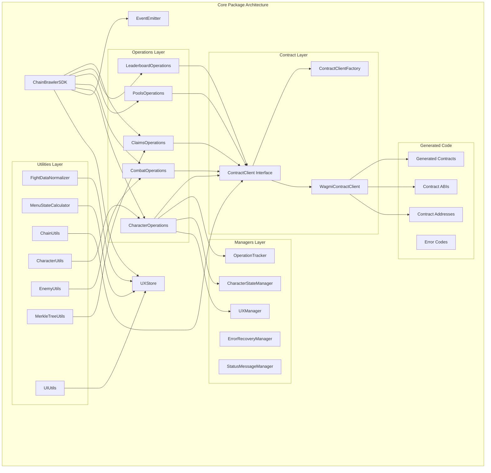
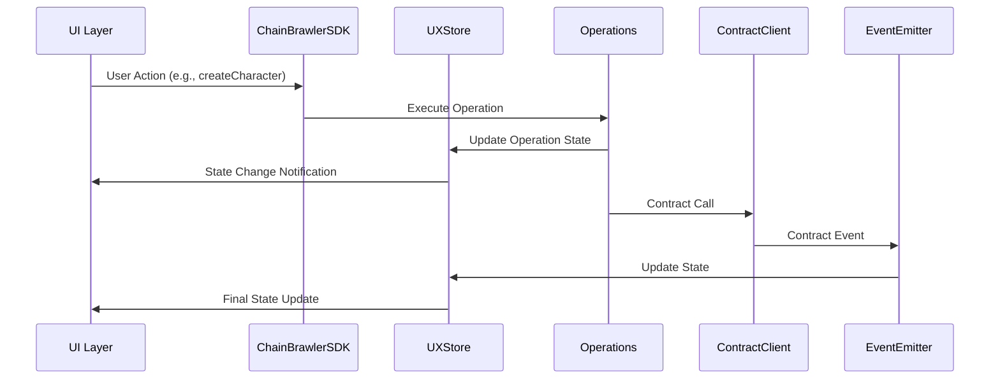

# @chainbrawler/core

**Core business logic for ChainBrawler - environment agnostic**

The `@chainbrawler/core` package is the heart of the ChainBrawler ecosystem, providing all the business logic, state management, and contract interactions in an environment-agnostic way. It's designed to work seamlessly across different environments (React, Node.js, etc.) without being tied to any specific UI framework.

## 🏗️ Architecture Overview

The core package follows a modular, event-driven architecture with clear separation of concerns:



## 📦 Package Structure

```
packages/core/
├── src/
│   ├── ChainBrawlerSDK.ts          # Main SDK orchestrator
│   ├── index.ts                     # Public API exports
│   ├── state/
│   │   └── UXStore.ts              # Centralized state management
│   ├── operations/                 # Business logic operations
│   │   ├── BaseOperation.ts        # Base operation class
│   │   ├── CharacterOperations.ts  # Character management
│   │   ├── CombatOperations.ts     # Combat system
│   │   ├── PoolsOperations.ts      # Prize pools
│   │   ├── LeaderboardOperations.ts # Leaderboard system
│   │   └── ClaimsOperations.ts     # Prize claims
│   ├── managers/                   # State and operation managers
│   │   ├── UXManager.ts           # High-level UX coordination
│   │   ├── CharacterStateManager.ts # Character state logic
│   │   ├── OperationTracker.ts    # Operation tracking
│   │   ├── ErrorRecoveryManager.ts # Error handling
│   │   └── StatusMessageManager.ts # Status messages
│   ├── contract/                   # Contract interaction layer
│   │   ├── ContractClient.ts       # Contract interface
│   │   ├── WagmiContractClient.ts  # Wagmi implementation
│   │   └── ContractClientFactory.ts # Client factory
│   ├── events/                     # Event system
│   │   ├── EventEmitter.ts         # Event emitter
│   │   └── EventHandler.ts         # Event handling
│   ├── types/                      # TypeScript type definitions
│   │   ├── index.ts               # Main types
│   │   ├── ErrorType.ts           # Error types
│   │   ├── EventType.ts           # Event types
│   │   └── StatusMessageType.ts   # Status types
│   ├── utils/                      # Utility functions
│   │   ├── FightDataNormalizer.ts # Fight data processing
│   │   ├── MenuStateCalculator.ts # Menu state logic
│   │   ├── ChainUtils.ts          # Blockchain utilities
│   │   ├── CharacterUtils.ts      # Character utilities
│   │   ├── EnemyUtils.ts          # Enemy utilities
│   │   ├── MerkleTreeUtils.ts     # Merkle tree operations
│   │   └── UIUtils.ts             # UI formatting utilities
│   ├── validation/                 # Data validation
│   │   ├── ValidationManager.ts   # Validation coordinator
│   │   └── ValidationRules.ts     # Validation rules
│   ├── generated/                  # Auto-generated code
│   │   ├── contractAddresses.ts   # Contract addresses
│   │   ├── contractABI.ts         # Contract ABIs
│   │   ├── contracts.ts           # Generated contracts
│   │   ├── errorCodes.ts          # Error codes
│   │   └── leaderboardTreasuryABI.ts # Treasury ABI
│   └── constants/
│       └── enemies.ts             # Enemy definitions
├── scripts/                        # Build and generation scripts
│   ├── generate-addresses.ts      # Address generation
│   └── generate-error-codes.ts    # Error code generation
├── package.json
├── tsconfig.json
├── vitest.config.ts
└── wagmi.config.ts
```

## 🚀 Key Features

### 1. **Environment Agnostic Design**
- No UI framework dependencies
- Works in React, Node.js, and other environments
- Clean separation between business logic and presentation

### 2. **Comprehensive State Management**
- Centralized UX state with Zustand
- Reactive state updates
- Optimistic UI updates
- Error state management

### 3. **Event-Driven Architecture**
- Real-time contract event listening
- Custom event system for internal communication
- Event-driven state updates

### 4. **Modular Operations System**
- Character management (create, heal, resurrect)
- Combat system (fight, flee, continue)
- Prize pool management
- Leaderboard system
- Claims and rewards

### 5. **Robust Error Handling**
- Comprehensive error types
- Error recovery mechanisms
- User-friendly error messages
- Retry logic for failed operations

### 6. **Type Safety**
- Full TypeScript coverage
- Generated types from contracts
- Strict type checking
- IntelliSense support

## 🔧 Core Components

### ChainBrawlerSDK
The main orchestrator that coordinates all operations and manages the application state.

```typescript
import { ChainBrawlerSDK } from '@chainbrawler/core';

const sdk = new ChainBrawlerSDK({
  address: '0x...',
  chain: { id: 2030, name: 'Conflux Testnet' },
  publicClient: publicClient,
  walletClient: walletClient,
  wagmiConfig: wagmiConfig
});

// Subscribe to state changes
sdk.subscribe((state) => {
  console.log('State updated:', state);
});

// Perform operations
await sdk.actions.createCharacter(1);
await sdk.actions.fightEnemy(1, 5);
```

### UXStore
Centralized state management using Zustand for reactive updates.

```typescript
// State structure
interface UXState {
  playerAddress: string | null;
  character: CharacterData | null;
  menu: MenuState | null;
  operation: OperationState | null;
  pools: PoolsData | null;
  leaderboard: LeaderboardData | null;
  claims: ClaimsData | null;
  statusMessage: string;
  isLoading: boolean;
  error: string | null;
  // Event data
  lastFightSummary?: FightSummaryData;
  lastEquipmentDropped?: EquipmentDropData;
  lastHealing?: HealingData;
  lastResurrection?: ResurrectionData;
}
```

### Operations System
Modular operations for different game aspects:

- **CharacterOperations**: Character creation, healing, resurrection
- **CombatOperations**: Fighting enemies, combat state management
- **PoolsOperations**: Prize pool data and management
- **LeaderboardOperations**: Leaderboard data and rankings
- **ClaimsOperations**: Prize claims and Merkle proofs

### Contract Integration
Environment-agnostic contract interaction through the `ContractClient` interface:

```typescript
interface ContractClient {
  // Read operations
  getCharacter(player: Address): Promise<CharacterData>;
  isCharacterInCombat(player: Address): Promise<boolean>;
  getCombatState(player: Address): Promise<CombatStateData>;
  // ... more read operations
  
  // Write operations
  createCharacter(characterClass: number, value: bigint): Promise<Hash>;
  fightEnemy(enemyId: number, enemyLevel: number): Promise<Hash>;
  // ... more write operations
  
  // Event watching
  watchFightSummaryEvent(onLogs: (logs: FightSummaryEventLog[]) => void): void;
  // ... more event watchers
}
```

## 📊 Data Flow



## 🛠️ Development

### Prerequisites
- Node.js 18+
- pnpm
- TypeScript

### Installation
```bash
pnpm install
```

### Build
```bash
pnpm build
```

### Development
```bash
pnpm dev
```

### Testing
```bash
pnpm test
pnpm test:watch
pnpm test:coverage
```

### Code Generation
```bash
# Generate contract types and addresses
pnpm generate:all

# Individual generation
pnpm generate              # Wagmi contract generation
pnpm generate:addresses    # Contract addresses
pnpm generate:errors       # Error codes
```

### Linting and Formatting
```bash
pnpm lint
pnpm lint:fix
pnpm format
pnpm format:check
```

## 🔗 Integration

### With React
```typescript
import { ChainBrawlerSDK } from '@chainbrawler/core';
import { useChainBrawler } from '@chainbrawler/react';

// The React package provides hooks that use the core SDK
const { character, actions, isLoading } = useChainBrawler();
```

### With Other Frameworks
```typescript
import { ChainBrawlerSDK } from '@chainbrawler/core';

// Direct usage in any JavaScript/TypeScript environment
const sdk = new ChainBrawlerSDK(config);
await sdk.actions.createCharacter(1);
```

## 📈 Performance Considerations

- **Optimistic Updates**: UI updates immediately for better UX
- **Event-Driven**: Real-time updates without polling
- **Batch Operations**: Multiple operations can be batched
- **Error Recovery**: Automatic retry mechanisms
- **State Normalization**: Efficient state management

## 🔒 Security

- **Input Validation**: All inputs are validated before contract calls
- **Error Handling**: Comprehensive error handling prevents crashes
- **Type Safety**: TypeScript prevents many runtime errors
- **Contract Verification**: All contract interactions are verified

## 📝 License

Apache-2.0 - see [LICENSE](../../LICENSE) for details.

## 🤝 Contributing

1. Fork the repository
2. Create a feature branch
3. Make your changes
4. Add tests
5. Submit a pull request

## 📞 Support

For questions and support, please open an issue in the main repository.
