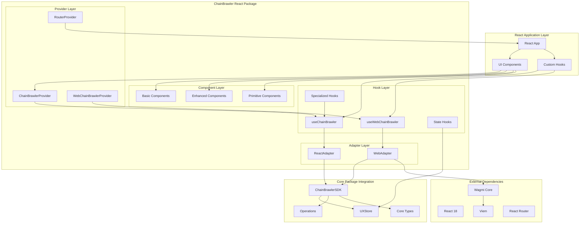

# ChainBrawler React Architecture

## System Overview

The ChainBrawler React package is designed as a React-specific adapter layer that provides hooks, context providers, and UI components for integrating ChainBrawler functionality into React applications. It bridges the environment-agnostic core package with React-specific patterns and best practices.

## Architecture Diagram



## Component Responsibilities

### 1. Hook Layer
**Purpose**: Provide React-specific hooks for ChainBrawler functionality

#### Main Hooks
- **useChainBrawler**: Main hook for generic React applications
- **useWebChainBrawler**: Web-specific hook with Wagmi integration

#### Specialized Hooks
- **useClaims**: Claims-specific functionality
- **useLeaderboard**: Leaderboard-specific functionality
- **usePools**: Pools-specific functionality
- **useUXState**: UX state management
- **useWalletManager**: Wallet connection management

### 2. Provider Layer
**Purpose**: React context providers for state management and configuration

#### ChainBrawlerProvider
- Main context provider for React applications
- Provides ChainBrawler state and actions to child components
- Manages adapter lifecycle

#### WebChainBrawlerProvider
- Web-specific context provider
- Integrates with Wagmi ecosystem
- Handles wallet connection state

#### RouterProvider
- React Router integration
- Navigation state management
- Route-based component rendering

### 3. Adapter Layer
**Purpose**: Bridge between React and the core package

#### ReactAdapter
- Generic React adapter
- Works in any React environment
- Minimal dependencies

#### WebAdapter
- Web-specific adapter
- Wagmi integration
- RainbowKit compatibility
- Enhanced web features

### 4. Component Layer
**Purpose**: UI components for different use cases

#### Basic Components
- Simple, functional components
- Minimal styling
- Core functionality display

#### Enhanced Components
- Rich UI with animations
- Advanced interactions
- Better user experience

#### Primitive Components
- Low-level building blocks
- Highly reusable
- Composable design

## Data Flow Patterns

### 1. Hook-Based Data Flow
```
Component → Hook → Adapter → Core SDK → Store → Hook → Component
```

### 2. Context-Based Data Flow
```
Provider → Context → Hook → Component
```

### 3. Event-Driven Updates
```
Core Event → Store → Hook → Component Re-render
```

## Key Design Patterns

### 1. **Adapter Pattern**
- Environment-specific adapters
- Consistent interface across environments
- Easy switching between implementations

### 2. **Hook Pattern**
- Custom hooks for state management
- Separation of concerns
- Reusable logic

### 3. **Provider Pattern**
- Context-based state sharing
- Eliminates prop drilling
- Centralized configuration

### 4. **Component Composition**
- Three-tier component system
- Composable design
- Flexible UI building

## Integration Points

### 1. **With Core Package**
- Direct integration with ChainBrawlerSDK
- Re-exported types and utilities
- Seamless state management

### 2. **With Wagmi Ecosystem**
- WebAdapter uses Wagmi contracts
- RainbowKit integration
- Wallet connection management

### 3. **With React Router**
- RouterProvider for navigation
- Route-based state management
- Deep linking support

## Performance Optimizations

### 1. **Selective Re-renders**
- Hook-based state subscriptions
- Memoized components
- Efficient state updates

### 2. **Lazy Loading**
- Dynamic imports for components
- Code splitting support
- On-demand loading

### 3. **Memory Management**
- Automatic cleanup on unmount
- Event listener cleanup
- Adapter lifecycle management

## State Management Architecture

### 1. **Centralized State**
- Single source of truth in Core package
- Reactive updates through Zustand
- Type-safe state access

### 2. **Local State**
- Component-specific state
- UI-only state management
- Temporary state handling

### 3. **Derived State**
- Computed values from core state
- Memoized calculations
- Optimized re-computation

## Error Handling Strategy

### 1. **Error Boundaries**
- React error boundaries for components
- Graceful error recovery
- User-friendly error messages

### 2. **Hook-Level Error Handling**
- Error state in hooks
- Retry mechanisms
- Fallback states

### 3. **Adapter Error Handling**
- Network error handling
- Contract error handling
- Wallet error handling

## Testing Strategy

### 1. **Unit Tests**
- Individual hook testing
- Component testing
- Adapter testing

### 2. **Integration Tests**
- Hook-adapter integration
- Provider-context integration
- Component interaction testing

### 3. **E2E Tests**
- Full application testing
- User workflow testing
- Cross-browser testing

## Type Safety

### 1. **TypeScript Integration**
- Full TypeScript coverage
- Re-exported core types
- IntelliSense support

### 2. **Type Guards**
- Runtime type checking
- Safe type assertions
- Error prevention

### 3. **Generic Types**
- Flexible component props
- Reusable type definitions
- Type inference

## Security Considerations

### 1. **Input Validation**
- All inputs validated through core
- Type safety at compile time
- Runtime validation

### 2. **Wallet Security**
- Secure wallet integration
- No private key exposure
- Transaction validation

### 3. **XSS Prevention**
- Sanitized user inputs
- Safe HTML rendering
- Content Security Policy

## Future Extensibility

### 1. **New Hooks**
- Easy to add new specialized hooks
- Consistent patterns
- Reusable base classes

### 2. **New Components**
- Three-tier component system
- Composable design
- Theme support

### 3. **New Adapters**
- Environment-specific adapters
- Consistent interface
- Easy integration

## Migration Strategies

### 1. **Version Updates**
- Backward compatibility
- Deprecation warnings
- Migration guides

### 2. **API Changes**
- Gradual migration
- Feature flags
- Compatibility layers

### 3. **Breaking Changes**
- Clear migration paths
- Automated tools
- Documentation updates
