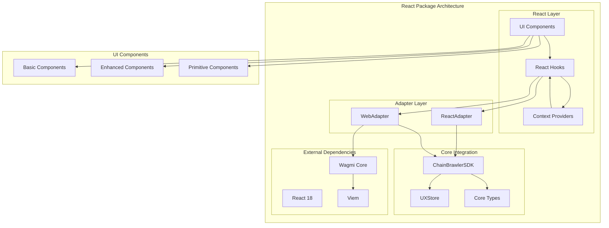
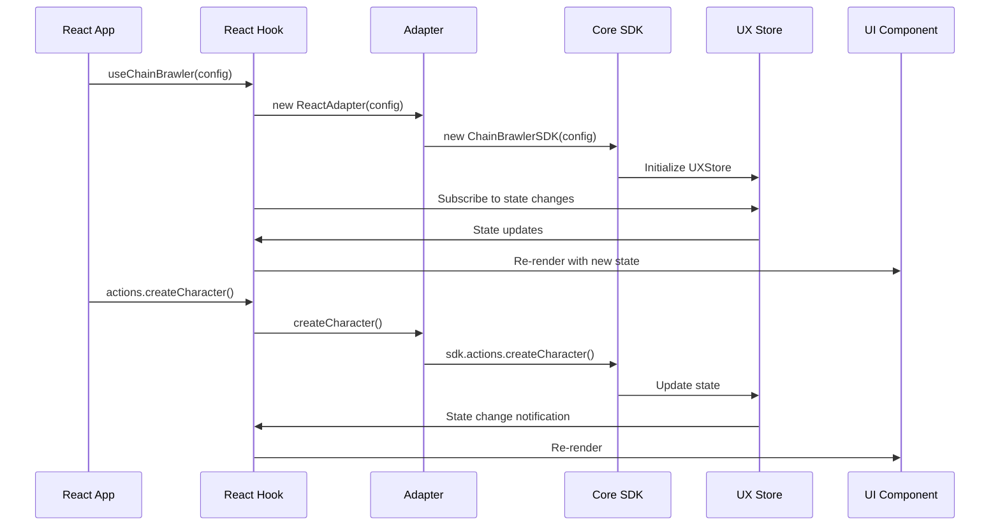

# @chainbrawler/react

**React adapter for ChainBrawler - hooks, context, and components**

The `@chainbrawler/react` package provides React-specific integrations for the ChainBrawler ecosystem. It offers hooks, context providers, and UI components that make it easy to integrate ChainBrawler functionality into React applications.

## 🏗️ Architecture Overview

The React package follows a layered architecture that bridges the environment-agnostic core package with React-specific patterns:



## 📦 Package Structure

```
packages/react/
├── src/
│   ├── index.ts                     # Public API exports
│   ├── adapters/                    # Environment adapters
│   │   ├── ReactAdapter.ts         # Generic React adapter
│   │   └── WebAdapter.ts           # Web-specific adapter with Wagmi
│   ├── hooks/                       # React hooks
│   │   ├── useChainBrawler.ts      # Main ChainBrawler hook
│   │   ├── useUXState.ts           # UX state management hook
│   │   ├── useClaims.ts            # Claims-specific hook
│   │   ├── useLeaderboard.ts       # Leaderboard-specific hook
│   │   ├── usePools.ts             # Pools-specific hook
│   │   ├── useWalletManager.ts     # Wallet management hook
│   │   ├── useWebChainBrawler.ts   # Web-specific main hook
│   │   ├── useWebClaims.ts         # Web-specific claims hook
│   │   ├── useWebLeaderboard.ts    # Web-specific leaderboard hook
│   │   └── useWebPools.ts          # Web-specific pools hook
│   ├── providers/                   # React context providers
│   │   ├── ChainBrawlerProvider.tsx    # Main context provider
│   │   ├── WebChainBrawlerProvider.tsx # Web-specific provider
│   │   └── RouterProvider.tsx      # Router integration
│   ├── components/                  # Basic UI components
│   │   ├── CharacterDisplay.tsx    # Character display component
│   │   ├── ClaimsDisplay.tsx       # Claims display component
│   │   ├── ErrorDisplay.tsx        # Error display component
│   │   ├── LeaderboardDisplay.tsx  # Leaderboard display component
│   │   ├── PoolsDisplay.tsx        # Pools display component
│   │   └── StatusDisplay.tsx       # Status display component
│   ├── ui/                         # Advanced UI components
│   │   ├── enhanced/               # Enhanced components with better UX
│   │   │   ├── CharacterDisplay.tsx
│   │   │   ├── ClaimsDisplay.tsx
│   │   │   ├── ErrorDisplay.tsx
│   │   │   ├── LeaderboardDisplay.tsx
│   │   │   ├── PoolsDisplay.tsx
│   │   │   └── StatusDisplay.tsx
│   │   └── primitives/             # Low-level primitive components
│   │       ├── EnemySelection.tsx  # Enemy selection component
│   │       ├── FightSummary.tsx    # Fight summary display
│   │       └── OperationStatus.tsx # Operation status indicator
│   ├── examples/                   # Usage examples
│   │   └── App.tsx                 # Example application
│   └── test/                       # Test files
│       ├── hooks/                  # Hook tests
│       ├── components/             # Component tests
│       ├── providers/              # Provider tests
│       └── adapters/               # Adapter tests
├── package.json
├── tsconfig.json
└── vitest.config.ts
```

## 🚀 Key Features

### 1. **Dual Adapter System**
- **ReactAdapter**: Generic React adapter for any environment
- **WebAdapter**: Web-specific adapter with Wagmi integration
- Seamless switching between adapters

### 2. **Comprehensive Hook System**
- **Main Hooks**: `useChainBrawler`, `useWebChainBrawler`
- **Specialized Hooks**: `useClaims`, `useLeaderboard`, `usePools`
- **State Hooks**: `useUXState`, `useWalletManager`
- Type-safe and optimized for React patterns

### 3. **Context Providers**
- **ChainBrawlerProvider**: Main context for React applications
- **WebChainBrawlerProvider**: Web-specific context with Wagmi
- **RouterProvider**: React Router integration
- Automatic state management and prop drilling elimination

### 4. **Three-Tier Component System**
- **Basic Components**: Simple, functional components
- **Enhanced Components**: Rich UI with animations and interactions
- **Primitive Components**: Low-level, reusable building blocks

### 5. **Type Safety**
- Full TypeScript coverage
- Re-exported core types
- IntelliSense support for all APIs

## 🔧 Core Components

### Hooks

#### useChainBrawler
Main hook for ChainBrawler functionality in React applications.

```typescript
import { useChainBrawler } from '@chainbrawler/react';

function MyComponent() {
  const {
    character,
    menu,
    pools,
    leaderboard,
    claims,
    isLoading,
    error,
    actions
  } = useChainBrawler(config);

  return (
    <div>
      {character && <CharacterInfo character={character} />}
      {menu?.canCreateCharacter && (
        <button onClick={() => actions.createCharacter(1)}>
          Create Character
        </button>
      )}
    </div>
  );
}
```

#### useWebChainBrawler
Web-specific hook with Wagmi integration.

```typescript
import { useWebChainBrawler } from '@chainbrawler/react';

function WebComponent() {
  const {
    character,
    actions,
    isLoading
  } = useWebChainBrawler(config);

  // Automatically handles wallet connection and Wagmi integration
  return <div>...</div>;
}
```

#### Specialized Hooks
```typescript
// Claims-specific functionality
const { claims, loadClaims, claimPrize } = useClaims();

// Leaderboard-specific functionality
const { leaderboard, loadLeaderboard } = useLeaderboard();

// Pools-specific functionality
const { pools, loadPools } = usePools();
```

### Context Providers

#### ChainBrawlerProvider
Main context provider for React applications.

```typescript
import { ChainBrawlerProvider } from '@chainbrawler/react';

function App() {
  return (
    <ChainBrawlerProvider config={config}>
      <MyGameComponent />
    </ChainBrawlerProvider>
  );
}

function MyGameComponent() {
  const { character, actions } = useChainBrawlerContext();
  // Use ChainBrawler functionality
}
```

#### WebChainBrawlerProvider
Web-specific provider with Wagmi integration.

```typescript
import { WebChainBrawlerProvider } from '@chainbrawler/react';

function WebApp() {
  return (
    <WebChainBrawlerProvider config={config}>
      <MyWebGameComponent />
    </WebChainBrawlerProvider>
  );
}
```

### UI Components

#### Basic Components
Simple, functional components for basic functionality.

```typescript
import { 
  CharacterDisplay,
  ClaimsDisplay,
  LeaderboardDisplay,
  PoolsDisplay,
  ErrorDisplay,
  StatusDisplay
} from '@chainbrawler/react';

function GameUI() {
  return (
    <div>
      <CharacterDisplay />
      <PoolsDisplay />
      <LeaderboardDisplay />
      <ClaimsDisplay />
    </div>
  );
}
```

#### Enhanced Components
Rich UI components with animations and interactions.

```typescript
import { 
  EnhancedCharacterDisplay,
  EnhancedClaimsDisplay,
  EnhancedLeaderboardDisplay
} from '@chainbrawler/react';

function EnhancedGameUI() {
  return (
    <div>
      <EnhancedCharacterDisplay />
      <EnhancedClaimsDisplay />
      <EnhancedLeaderboardDisplay />
    </div>
  );
}
```

#### Primitive Components
Low-level, reusable building blocks.

```typescript
import { 
  EnemySelection,
  FightSummary,
  OperationStatus
} from '@chainbrawler/react';

function CustomGameUI() {
  return (
    <div>
      <EnemySelection onSelect={handleEnemySelect} />
      <FightSummary fight={lastFight} />
      <OperationStatus operation={currentOperation} />
    </div>
  );
}
```

## 🔄 Data Flow



## 🛠️ Development

### Prerequisites
- Node.js 18+
- React 18+
- pnpm

### Installation
```bash
pnpm install
```

### Build
```bash
pnpm build
```

### Development
```bash
pnpm dev
```

### Testing
```bash
pnpm test
pnpm test:watch
pnpm test:coverage
```

### Linting and Formatting
```bash
pnpm lint
pnpm lint:fix
pnpm format
pnpm format:check
```

## 🔗 Integration

### With Core Package
```typescript
import { ChainBrawlerSDK } from '@chainbrawler/core';
import { useChainBrawler } from '@chainbrawler/react';

// The React package automatically uses the core SDK
const { character, actions } = useChainBrawler(config);
```

### With Web Applications
```typescript
import { WagmiProvider } from 'wagmi';
import { WebChainBrawlerProvider } from '@chainbrawler/react';

function App() {
  return (
    <WagmiProvider config={wagmiConfig}>
      <WebChainBrawlerProvider config={chainBrawlerConfig}>
        <GameComponent />
      </WebChainBrawlerProvider>
    </WagmiProvider>
  );
}
```

### With React Router
```typescript
import { BrowserRouter } from 'react-router-dom';
import { RouterProvider } from '@chainbrawler/react';

function App() {
  return (
    <BrowserRouter>
      <RouterProvider>
        <Routes>
          <Route path="/game" element={<GameComponent />} />
        </Routes>
      </RouterProvider>
    </BrowserRouter>
  );
}
```

## 📊 Performance Considerations

### 1. **Optimized Re-renders**
- Selective state subscriptions
- Memoized components where appropriate
- Efficient state updates

### 2. **Lazy Loading**
- Components can be lazy-loaded
- Hooks support code splitting
- Dynamic imports for large components

### 3. **Memory Management**
- Automatic cleanup on unmount
- Event listener cleanup
- Adapter lifecycle management

## 🔒 Security

### 1. **Input Validation**
- All inputs validated through core package
- Type safety at compile time
- Runtime validation for user inputs

### 2. **Error Boundaries**
- Graceful error handling
- User-friendly error messages
- Recovery mechanisms

### 3. **Wallet Security**
- Secure wallet integration
- No private key exposure
- Transaction validation

## 📝 Examples

### Basic Usage
```typescript
import React from 'react';
import { ChainBrawlerProvider, useChainBrawlerContext } from '@chainbrawler/react';

const config = {
  address: '0x...',
  chain: { id: 2030, name: 'Conflux Testnet' },
  publicClient: publicClient,
  walletClient: walletClient,
  wagmiConfig: wagmiConfig
};

function GameComponent() {
  const { character, actions, isLoading } = useChainBrawlerContext();

  if (isLoading) return <div>Loading...</div>;

  return (
    <div>
      {character ? (
        <div>
          <h2>{character.className} - Level {character.level}</h2>
          <button onClick={() => actions.fightEnemy(1, 5)}>
            Fight Enemy
          </button>
        </div>
      ) : (
        <button onClick={() => actions.createCharacter(1)}>
          Create Character
        </button>
      )}
    </div>
  );
}

function App() {
  return (
    <ChainBrawlerProvider config={config}>
      <GameComponent />
    </ChainBrawlerProvider>
  );
}
```

### Web Integration
```typescript
import { WagmiProvider } from 'wagmi';
import { WebChainBrawlerProvider } from '@chainbrawler/react';

function WebApp() {
  return (
    <WagmiProvider config={wagmiConfig}>
      <WebChainBrawlerProvider config={chainBrawlerConfig}>
        <GameComponent />
      </WebChainBrawlerProvider>
    </WagmiProvider>
  );
}
```

### Custom Components
```typescript
import { useChainBrawler } from '@chainbrawler/react';

function CustomCharacterCard() {
  const { character, actions } = useChainBrawler(config);

  return (
    <div className="character-card">
      <h3>{character?.className || 'No Character'}</h3>
      <div className="stats">
        <div>Level: {character?.level || 0}</div>
        <div>XP: {character?.experience || 0}</div>
        <div>Health: {character?.endurance.current || 0}/{character?.endurance.max || 0}</div>
      </div>
      <div className="actions">
        <button onClick={() => actions.healCharacter()}>
          Heal
        </button>
        <button onClick={() => actions.fightEnemy(1, 5)}>
          Fight
        </button>
      </div>
    </div>
  );
}
```

## 📈 Testing

### Hook Testing
```typescript
import { renderHook } from '@testing-library/react';
import { useChainBrawler } from '@chainbrawler/react';

test('useChainBrawler returns initial state', () => {
  const { result } = renderHook(() => useChainBrawler(config));
  
  expect(result.current.isLoading).toBe(true);
  expect(result.current.character).toBeNull();
});
```

### Component Testing
```typescript
import { render, screen } from '@testing-library/react';
import { ChainBrawlerProvider } from '@chainbrawler/react';

test('renders character display', () => {
  render(
    <ChainBrawlerProvider config={config}>
      <CharacterDisplay />
    </ChainBrawlerProvider>
  );
  
  expect(screen.getByText('No Character')).toBeInTheDocument();
});
```

## 📝 License

Apache-2.0 - see [LICENSE](../../LICENSE) for details.

## 🤝 Contributing

1. Fork the repository
2. Create a feature branch
3. Make your changes
4. Add tests
5. Submit a pull request

## 📞 Support

For questions and support, please open an issue in the main repository.
