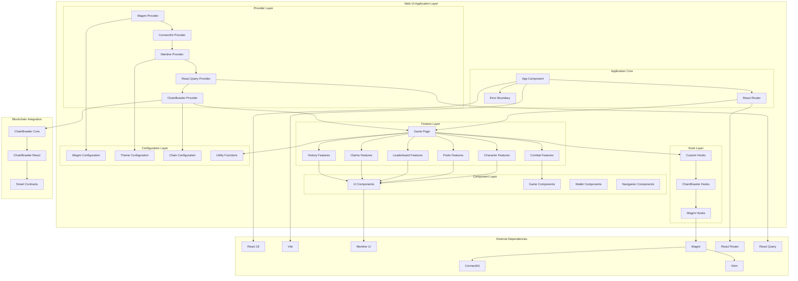

# ChainBrawler Web UI Architecture

## System Overview

The ChainBrawler Web UI is a modern React application that provides the complete frontend experience for the ChainBrawler blockchain RPG game. It follows a feature-driven architecture with clear separation of concerns, excellent user experience, and seamless integration with the blockchain ecosystem.

## Architecture Diagram



## Component Responsibilities

### 1. Application Core
**Purpose**: Main application orchestration and routing

#### App Component
- Application entry point
- Error boundary management
- Global state initialization
- Route configuration

#### Router
- Navigation management
- Route-based rendering
- Deep linking support
- Browser history integration

#### Error Boundary
- Error catching and handling
- Fallback UI rendering
- Error reporting
- Recovery mechanisms

### 2. Provider Layer
**Purpose**: Context providers for state management and configuration

#### WagmiProvider
- Blockchain connection management
- Wallet integration
- Chain switching
- Transaction handling

#### ConnectKitProvider
- Wallet connection UI
- Wallet selection
- Connection status
- User experience enhancements

#### MantineProvider
- UI component theming
- Design system integration
- Responsive design
- Accessibility features

#### QueryClientProvider
- Data fetching and caching
- Background updates
- Error handling
- Loading states

#### ChainBrawlerProvider
- Game state management
- ChainBrawler SDK integration
- Event handling
- Action coordination

### 3. Feature Layer
**Purpose**: Feature-specific components and functionality

#### Game Page
- Main game interface
- Tab navigation
- State management
- Event handling

#### Character Features
- Character creation
- Character management
- Stat display
- Progression tracking

#### Combat Features
- Enemy selection
- Combat interface
- Fight summaries
- Combat state management

#### Pools Features
- Treasury pool display
- Pool information
- Real-time updates
- Pool statistics

#### Leaderboard Features
- Player rankings
- Score display
- Epoch management
- Player statistics

#### Claims Features
- Prize claiming
- Claim history
- Proof verification
- Claim status

#### History Features
- Transaction history
- Activity tracking
- Event logging
- User analytics

### 4. Component Layer
**Purpose**: Reusable UI components

#### UI Components
- Basic UI elements
- Layout components
- Form components
- Display components

#### Game Components
- Game-specific UI
- Interactive elements
- Animation components
- Game state displays

#### Wallet Components
- Wallet connection UI
- Wallet status
- Transaction modals
- Connection management

#### Navigation Components
- Navigation bars
- Tab navigation
- Mobile navigation
- Breadcrumbs

### 5. Hook Layer
**Purpose**: Custom React hooks for state management and side effects

#### Custom Hooks
- Application state management
- Local storage integration
- Event handling
- Utility functions

#### ChainBrawler Hooks
- Game state access
- Action dispatching
- Event subscription
- State synchronization

#### Wagmi Hooks
- Wallet connection
- Chain switching
- Transaction handling
- Account management

### 6. Configuration Layer
**Purpose**: Application configuration and utilities

#### Wagmi Configuration
- Chain definitions
- RPC endpoints
- Connector setup
- Transport configuration

#### Theme Configuration
- Design tokens
- Color palettes
- Typography
- Component styling

#### Chain Configuration
- Supported chains
- Chain metadata
- Contract addresses
- Network configuration

#### Utility Functions
- Helper functions
- Data transformation
- Validation
- Formatting

## Data Flow Patterns

### 1. User Interaction Flow
```
User Action → Component → Hook → ChainBrawler → Smart Contract → Blockchain
                ↓
            State Update → UI Re-render → User Feedback
```

### 2. Event-Driven Updates
```
Blockchain Event → Smart Contract → ChainBrawler → Hook → Component → UI Update
```

### 3. State Management Flow
```
User Action → Hook → State Update → Context → Component → UI Re-render
```

### 4. Wallet Integration Flow
```
Wallet Connection → Wagmi → ConnectKit → ChainBrawler → Game State
```

## Key Design Patterns

### 1. **Feature-Driven Architecture**
- Features organized by domain
- Clear separation of concerns
- Reusable components
- Modular structure

### 2. **Provider Pattern**
- Context-based state sharing
- Hierarchical provider structure
- Dependency injection
- Configuration management

### 3. **Hook Pattern**
- Custom hooks for logic
- State management
- Side effects
- Reusable functionality

### 4. **Component Composition**
- Composable components
- Props-based communication
- Render props pattern
- Higher-order components

## State Management Architecture

### 1. **Global State**
- Wagmi for blockchain state
- ChainBrawler for game state
- React Query for server state
- Local storage for persistence

### 2. **Local State**
- Component-specific state
- UI-only state
- Temporary state
- Form state

### 3. **Derived State**
- Computed values
- Memoized calculations
- Cached data
- Optimized re-renders

## Performance Optimizations

### 1. **Code Splitting**
- Route-based splitting
- Component lazy loading
- Dynamic imports
- Bundle optimization

### 2. **Memoization**
- React.memo for components
- useMemo for calculations
- useCallback for functions
- Optimized re-renders

### 3. **Caching**
- React Query caching
- Local storage caching
- Memory caching
- Network request caching

### 4. **Bundle Optimization**
- Vite build optimization
- Tree shaking
- Dead code elimination
- Asset optimization

## Security Considerations

### 1. **Wallet Security**
- ConnectKit integration
- Secure wallet connection
- No private key storage
- Transaction validation

### 2. **Input Validation**
- Form validation
- Data sanitization
- Type checking
- Error handling

### 3. **Network Security**
- HTTPS enforcement
- Secure RPC endpoints
- API key protection
- Environment variable security

### 4. **Content Security**
- XSS prevention
- CSRF protection
- Content Security Policy
- Safe HTML rendering

## Responsive Design Strategy

### 1. **Mobile-First Approach**
- Mobile-first design
- Progressive enhancement
- Touch-friendly interfaces
- Optimized for small screens

### 2. **Breakpoint System**
- Consistent breakpoints
- Responsive utilities
- Flexible layouts
- Adaptive components

### 3. **Navigation Patterns**
- Mobile navigation
- Desktop navigation
- Tab-based navigation
- Context-aware navigation

## Testing Strategy

### 1. **Unit Tests**
- Component testing
- Hook testing
- Utility function testing
- Edge case coverage

### 2. **Integration Tests**
- Feature testing
- User flow testing
- API integration testing
- State management testing

### 3. **E2E Tests**
- Playwright testing
- User journey testing
- Cross-browser testing
- Performance testing

### 4. **Visual Tests**
- Component visual testing
- Responsive design testing
- Theme testing
- Accessibility testing

## Deployment Architecture

### 1. **Build Process**
- Vite build system
- TypeScript compilation
- Asset optimization
- Bundle analysis

### 2. **Docker Support**
- Containerized deployment
- Multi-stage builds
- Environment configuration
- Production optimization

### 3. **Static Hosting**
- CDN distribution
- Caching strategies
- Performance optimization
- Global availability

## Future Extensibility

### 1. **New Features**
- Feature-based architecture
- Modular components
- Plugin system
- Extension points

### 2. **New Chains**
- Chain configuration
- RPC endpoint management
- Contract address management
- Network-specific features

### 3. **New Wallets**
- Connector integration
- Wallet-specific features
- UI customization
- User experience enhancements

## Monitoring and Analytics

### 1. **Performance Monitoring**
- Bundle size tracking
- Load time monitoring
- Runtime performance
- User experience metrics

### 2. **Error Tracking**
- Error boundary reporting
- Exception tracking
- User feedback
- Debug information

### 3. **User Analytics**
- User behavior tracking
- Feature usage analytics
- Performance metrics
- Conversion tracking
