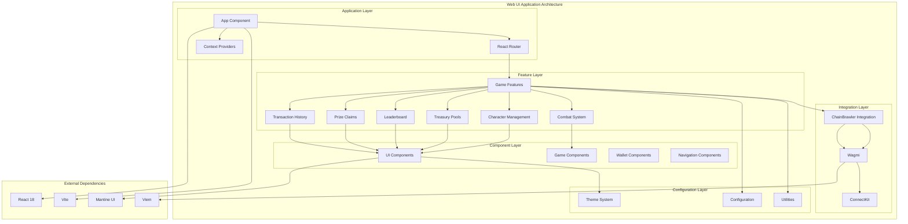

# @chainbrawler/web-ui

**ChainBrawler Web UI Application - Complete frontend implementation**

The `@chainbrawler/web-ui` package is a complete web application that provides the user interface for the ChainBrawler blockchain RPG game. It's built with React, Vite, and modern web technologies, featuring a beautiful dark theme and responsive design.

## 🏗️ Architecture Overview

The web-ui package follows a modern React architecture with clear separation of concerns and excellent user experience:



## 📦 Package Structure

```
packages/web-ui/
├── src/
│   ├── App.tsx                     # Main application component
│   ├── main.tsx                    # Application entry point
│   ├── app/                        # Application configuration
│   │   ├── config/
│   │   │   └── wagmi.ts           # Wagmi configuration
│   │   └── providers/
│   │       └── ChainBrawlerProvider.tsx # ChainBrawler provider
│   ├── components/                 # Reusable UI components
│   │   ├── game/                  # Game-specific components
│   │   │   ├── GameButton.tsx
│   │   │   ├── GameCard.tsx
│   │   │   ├── GameModal.tsx
│   │   │   ├── LoadingState.tsx
│   │   │   └── StatDisplay.tsx
│   │   ├── navigation/            # Navigation components
│   │   │   ├── MobileNavigation.tsx
│   │   │   └── index.ts
│   │   ├── wallet/                # Wallet components
│   │   │   ├── WalletActionBar.tsx
│   │   │   └── index.ts
│   │   ├── AppFooter.tsx
│   │   ├── AppHeader.tsx
│   │   ├── ErrorBoundary.tsx
│   │   ├── LoadingScreen.tsx
│   │   ├── RPCStatus.tsx
│   │   ├── WalletConnection.tsx
│   │   ├── WalletTest.tsx
│   │   └── WelcomeScreen.tsx
│   ├── features/                  # Feature-specific components
│   │   ├── character/             # Character management
│   │   │   ├── CharacterCreationForm.tsx
│   │   │   └── CharacterDetailCard.tsx
│   │   ├── combat/                # Combat system
│   │   │   ├── EnemySelectionModal.tsx
│   │   │   ├── FightSummaryModal.tsx
│   │   │   └── MonsterArena.tsx
│   │   ├── game/                  # Main game interface
│   │   │   ├── GameHeader.tsx
│   │   │   └── GamePage.tsx
│   │   ├── history/               # Transaction history
│   │   │   └── TransactionHistoryDisplay.tsx
│   │   ├── leaderboard/           # Leaderboard system
│   │   │   └── LeaderboardDisplay.tsx
│   │   ├── pools/                 # Treasury pools
│   │   │   └── PoolsDisplay.tsx
│   │   ├── claims/                # Prize claims
│   │   │   └── ClaimsDisplay.tsx
│   │   └── transactions/          # Transaction management
│   │       └── TransactionModal.tsx
│   ├── hooks/                     # Custom React hooks
│   │   ├── useAppState.ts
│   │   ├── useGasConfig.ts
│   │   ├── useWalletEvents.ts
│   │   └── useWriteContractWithGas.ts
│   ├── config/                    # Configuration files
│   │   ├── chains.ts
│   │   ├── connectkit-theme.ts
│   │   ├── connectors.ts
│   │   ├── gas.ts
│   │   ├── wagmi-simple.ts
│   │   └── wagmi.ts
│   ├── styles/                    # Styling files
│   │   ├── connectkit.css
│   │   └── globals.css
│   ├── theme/                     # Theme system
│   │   ├── index.ts
│   │   └── tokens.ts
│   └── utils/                     # Utility functions
│       ├── chainUtils.ts
│       ├── rateLimiter.ts
│       └── writeCallWithGas.ts
├── scripts/                       # Build and utility scripts
├── docker-compose.yml
├── Dockerfile
├── index.html
├── package.json
├── tsconfig.json
├── tsconfig.node.json
├── vite.config.ts
└── vite.config-simple.ts
```

## 🚀 Key Features

### 1. **Complete Web Application**
- Full-featured React application
- Responsive design for all devices
- Modern dark theme with game aesthetics
- Progressive Web App capabilities

### 2. **Wallet Integration**
- ConnectKit for wallet connection
- MetaMask integration
- Multi-chain support (Conflux, Ethereum, Polygon, Arbitrum)
- Wallet connection status and management

### 3. **Game Features**
- Character creation and management
- Combat system with enemy selection
- Real-time fight summaries
- Equipment and stat progression
- Treasury pools and leaderboards
- Prize claims system

### 4. **User Experience**
- Intuitive navigation with tabs
- Mobile-responsive design
- Loading states and error handling
- Toast notifications
- Modal dialogs for actions

### 5. **Performance Optimization**
- Vite for fast development and building
- Code splitting and lazy loading
- Rate limiting for API calls
- Efficient state management

## 🔧 Core Components

### App Component
Main application orchestrator with routing and state management.

```typescript
function App() {
  return (
    <ErrorBoundary>
      <AppContent />
    </ErrorBoundary>
  );
}

function AppContent() {
  // Wallet connection logic
  // Chain validation
  // Contract deployment check
  // ChainBrawler provider setup
}
```

### GamePage Component
Main game interface with tabbed navigation.

```typescript
function GamePage() {
  const {
    character,
    menu,
    operation,
    statusMessage,
    isLoading,
    error,
    actions,
    pools,
    leaderboard,
    claims,
  } = useWebChainBrawlerContext();

  // Game state management
  // Event handling
  // Action handlers
  // UI rendering
}
```

### Character Management
Character creation and detail display components.

```typescript
// Character creation form
function CharacterCreationForm({ onCreateCharacter, isLoading, canCreate }) {
  // Character class selection
  // Creation form UI
  // Action handling
}

// Character detail card
function CharacterDetailCard({ character, menu, onHealCharacter, onResurrectCharacter }) {
  // Character stats display
  // Action buttons
  // Status indicators
}
```

### Combat System
Combat interface with enemy selection and fight summaries.

```typescript
// Enemy selection modal
function EnemySelectionModal({ opened, onClose, onFightEnemy }) {
  // Enemy list display
  // Level selection
  // Fight initiation
}

// Fight summary modal
function FightSummaryModal({ opened, onClose, fightSummary, onContinueFight, onFleeRound }) {
  // Fight results display
  // Action buttons
  // Equipment drops
}
```

## 🎨 Theme System

### Design Tokens
Comprehensive design system with consistent tokens.

```typescript
export const designTokens = {
  colors: {
    primary: { /* Primary color palette */ },
    secondary: { /* Secondary color palette */ },
    game: {
      combat: "#ef4444",
      defense: "#3b82f6", 
      luck: "#10b981",
      experience: "#f59e0b",
    },
    surface: {
      primary: "#0f172a",
      elevated: "rgba(30, 41, 59, 0.8)",
      overlay: "rgba(15, 23, 42, 0.95)",
    },
  },
  typography: {
    sizes: { /* Font sizes */ },
    weights: { /* Font weights */ },
  },
  spacing: { /* Spacing values */ },
  borderRadius: { /* Border radius values */ },
  shadows: { /* Shadow definitions */ },
  animation: { /* Animation timings */ },
};
```

### Mantine Theme
Custom Mantine theme with game-specific styling.

```typescript
export const theme = createTheme({
  primaryColor: "chainbrawler-primary",
  fontFamily: 'Inter, system-ui, sans-serif',
  colors: {
    "chainbrawler-primary": primaryColor,
    "chainbrawler-secondary": secondaryColor,
    "game-combat": combatColor,
    "game-defense": defenseColor,
    "game-luck": luckColor,
  },
  components: {
    Card: { /* Custom card styling */ },
    Button: { /* Custom button styling */ },
    Modal: { /* Custom modal styling */ },
  },
});
```

## 🔗 Integration

### ChainBrawler Integration
Seamless integration with the ChainBrawler ecosystem.

```typescript
// Wagmi configuration
export const config = createConfig(
  getDefaultConfig({
    chains: [confluxESpaceLocal, confluxESpaceTestnet, confluxESpace, mainnet, polygon, arbitrum],
    transports: {
      [confluxESpaceLocal.id]: http("http://127.0.0.1:8545"),
      [confluxESpaceTestnet.id]: fallback([/* Multiple RPC providers */]),
      // ... other chains
    },
    connectors: [metaMask({ /* MetaMask configuration */ })],
  })
);

// ChainBrawler provider setup
<ChainBrawlerProvider chainBrawlerConfig={chainBrawlerConfig}>
  <GamePage />
</ChainBrawlerProvider>
```

### Wallet Integration
ConnectKit and Wagmi for wallet management.

```typescript
// ConnectKit provider
<ConnectKitProvider
  mode="dark"
  customTheme={{ /* Custom theme */ }}
  options={{
    initialChainId: 71,
    enforceSupportedChains: false,
    disclaimer: "By connecting your wallet, you agree to the Terms of Service.",
  }}
>
  <MantineProvider theme={theme}>
    <App />
  </MantineProvider>
</ConnectKitProvider>
```

## 🛠️ Development

### Prerequisites
- Node.js 18+
- pnpm
- Modern web browser

### Installation
```bash
pnpm install
```

### Development
```bash
# Start development server
pnpm dev

# Start with simple config (no complex RPC setup)
pnpm dev-simple
```

### Build
```bash
pnpm build
```

### Preview
```bash
pnpm preview
```

### Testing
```bash
# Run Playwright tests
pnpm test

# Run tests with UI
pnpm test:ui

# Run tests in headed mode
pnpm test:headed
```

### Linting and Formatting
```bash
pnpm lint
pnpm lint:fix
pnpm format
pnpm format:check
```

## 🐳 Docker Support

### Docker Compose
```yaml
version: '3.8'
services:
  web-ui:
    build: .
    ports:
      - "3000:3000"
    environment:
      - VITE_WALLETCONNECT_PROJECT_ID=your_project_id
      - VITE_CONFLUX_API_KEY=your_api_key
```

### Dockerfile
```dockerfile
FROM node:18-alpine
WORKDIR /app
COPY package*.json ./
RUN npm install
COPY . .
RUN npm run build
EXPOSE 3000
CMD ["npm", "run", "preview"]
```

## 📱 Responsive Design

### Mobile Navigation
- Bottom navigation bar for mobile devices
- Tab-based navigation system
- Touch-friendly interface elements

### Desktop Interface
- Sidebar navigation
- Full-featured interface
- Keyboard shortcuts support

### Breakpoints
- Mobile: < 768px
- Tablet: 768px - 1024px
- Desktop: > 1024px

## 🎮 Game Features

### Character System
- **Character Creation**: 4 character classes with unique stats
- **Character Management**: View stats, equipment, and progression
- **Health System**: Healing and resurrection mechanics
- **Level Progression**: XP-based leveling with stat growth

### Combat System
- **Enemy Selection**: Choose from various enemies and levels
- **Combat Mechanics**: Deterministic combat with critical hits
- **Fight Summaries**: Detailed fight results and equipment drops
- **Combat State**: Resumable fights for large battles

### Treasury System
- **Pool Display**: View all treasury pools and values
- **Real-time Updates**: Live pool value updates
- **Pool Information**: Detailed pool breakdowns

### Leaderboard System
- **Rankings**: Player rankings and scores
- **Epoch Management**: Time-based leaderboard periods
- **Player Stats**: Individual player statistics

### Claims System
- **Prize Claims**: Merkle-based prize claiming
- **Claim History**: Track claimable and claimed prizes
- **Proof Verification**: Secure claim verification

## 🔧 Configuration

### Environment Variables
```bash
# WalletConnect Project ID
VITE_WALLETCONNECT_PROJECT_ID=your_project_id

# RPC API Keys
VITE_ALCHEMY_API_KEY=your_alchemy_key
VITE_INFURA_API_KEY=your_infura_key
VITE_CONFLUX_API_KEY=your_conflux_key
```

### Chain Configuration
- **Conflux Local**: Development chain (ID: 2030)
- **Conflux Testnet**: Test network (ID: 71)
- **Conflux Mainnet**: Production network (ID: 1030)
- **Ethereum**: Mainnet support
- **Polygon**: Layer 2 support
- **Arbitrum**: Layer 2 support

## 📊 Performance

### Optimization Features
- **Vite Build**: Fast development and optimized builds
- **Code Splitting**: Lazy loading of components
- **Rate Limiting**: Efficient API call management
- **Caching**: Smart caching for data requests

### Bundle Size
- **Development**: ~2MB (with source maps)
- **Production**: ~500KB (minified and gzipped)
- **Vendor**: ~300KB (React, Wagmi, Mantine)

## 🔒 Security

### Wallet Security
- **ConnectKit Integration**: Secure wallet connection
- **MetaMask Only**: Conservative connector configuration
- **Chain Validation**: Supported chain enforcement

### Data Security
- **No Private Keys**: No private key storage
- **Secure RPC**: Encrypted RPC connections
- **Input Validation**: All inputs validated

## 📝 License

Apache-2.0 - see [LICENSE](../../LICENSE) for details.

## 🤝 Contributing

1. Fork the repository
2. Create a feature branch
3. Make your changes
4. Add tests
5. Submit a pull request

## 📞 Support

For questions and support, please open an issue in the main repository.
