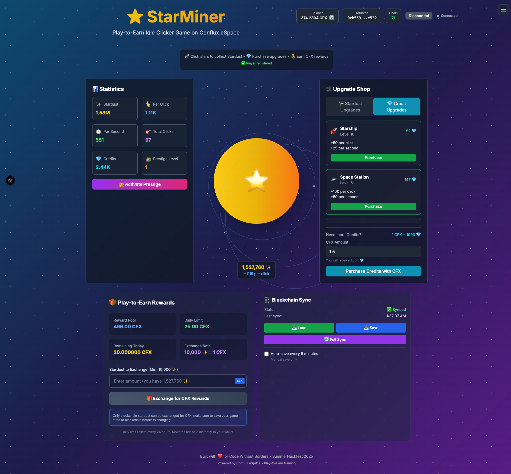
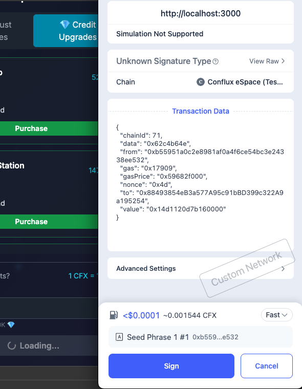

# StarMiner ⭐ - Play-to-Earn Idle Clicker Game

> **A space-themed idle clicker game with blockchain integration on Conflux eSpace**

[](LICENSE)
[](https://confluxnetwork.org)
[](https://github.com/conflux-fans/summerhackfest-2025)

## 🎯 Overview

**StarMiner** is an engaging space-themed idle clicker game where players collect Stardust by clicking on stars and purchasing upgrades. Built on Conflux eSpace, it features comprehensive play-to-earn mechanics, allowing players to exchange their in-game progress for real cryptocurrency rewards.

**Key Features:**
- 🌟 **Idle Clicker Mechanics**: Click to collect Stardust, purchase upgrades for passive income
- 🚀 **Space Theme**: Beautiful cosmic UI with telescopes, satellites, starships, and black holes
- 💎 **Dual Currency System**: Stardust (earned) + Credits (purchased with CFX)
- ⛓️ **Blockchain Integration**: Full Web3 integration with Conflux eSpace
- 💰 **Play-to-Earn**: Convert Stardust to CFX through smart contracts
- 🎮 **Progressive Upgrades**: 9 upgrade tiers from telescopes to universe engines

## 🏆 Hackathon Information

- **Event**: Code Without Borders - SummerHackfest 2025
- **Focus Area**: Gaming & Entertainment - Play-to-Earn GameFi
- **Team**: eSpaceDev
- **Submission Date**: September 15, 2025

## 👥 Team

| Name | Role | GitHub | Discord |
|------|------|--------|---------|
| Anicar Cabrera | Full-Stack Developer | [@anicarrr](https://github.com/anicarrr) | kaiji1413 |

## 🚀 Problem Statement

**Traditional idle clicker games lack real-world value and player ownership.**

Current idle/clicker games suffer from several limitations:
- **No Real Value**: Time invested has no monetary return (for now)
- **Centralized Control**: Game publishers control all assets and progress
- **Limited Monetization**: Only benefits game developers, not players
- **No Ownership**: Players can't truly own or trade their progress

Blockchain technology can solve these problems by enabling true asset ownership, decentralized gameplay, and play-to-earn mechanics that reward player engagement.

## 💡 Solution

**StarMiner transforms idle gaming into a rewarding blockchain experience.**

Our solution provides:
- **True Asset Ownership**: Players own their upgrades and progress via smart contracts
- **Play-to-Earn Mechanics**: Convert gameplay achievements into real CFX rewards
- **Transparent Economics**: All game mechanics are governed by auditable smart contracts
- **Cross-Platform Value**: Game assets have real-world value and can be traded
- **Sustainable Tokenomics**: Balanced economy that rewards both casual and dedicated players

## ⚡ Conflux Integration

**How StarMiner leverages Conflux eSpace features:**

- ✅ **eSpace** - Full Ethereum compatibility for easy development and user adoption
- ✅ **Low Gas Fees** - Affordable transactions for frequent game interactions
- ✅ **Fast Confirmations** - 3-second block times for responsive gameplay
- ✅ **EVM Compatibility** - Use familiar tools like MetaMask, Hardhat, and ethers.js
- ✅ **Smart Contracts** - Solidity contracts for game logic and P2E mechanics

### Partner Integrations
- **MetaMask/Fluent Wallet** - Seamless wallet connection for eSpace
- **ConfluxScan** - Contract verification and transaction monitoring

## ✨ Features

### Core Features
- **Click-to-Earn** - Generate Stardust by clicking the central star
- **Idle Generation** - Upgrades automatically generate Stardust over time
- **Upgrade System** - 9 different upgrades from telescopes to universe engines
- **Dual Currency** - Stardust (earned) and Credits (purchased with CFX)
- **Wallet Integration** - Connect with MetaMask or Fluent Wallet

### Advanced Features
- **Play-to-Earn** - Exchange Stardust for CFX through smart contracts
- **Prestige System** - Reset progress for permanent bonuses
- **NFT Upgrades** - Unique NFT-based upgrades with special bonuses
- **On-Chain State** - Game progress stored and verified on blockchain

### Future Features (Roadmap)
- **Achievement System** - Unlock rewards for reaching milestones
- **Leaderboards** - Compete with other players globally
- **Guild System** - Team up with other players for bonuses
- **Seasonal Events** - Limited-time upgrades and rewards

## 🛠️ Technology Stack

### Frontend
- **Framework**: Next.js 14 with App Router
- **Styling**: TailwindCSS + Framer Motion
- **State Management**: Zustand
- **Web3 Integration**: ethers.js v6 + Wagmi

### Backend
- **Blockchain**: Conflux eSpace (EVM-compatible)
- **Smart Contracts**: Solidity 0.8.19
- **Development**: Hardhat + OpenZeppelin
- **Testing**: Hardhat + Chai

### Infrastructure
- **Hosting**: Vercel (Frontend)
- **Storage**: IPFS (NFT metadata)
- **Monitoring**: ConfluxScan

## 🏗️ Architecture

```
┌─────────────────┐    ┌─────────────────┐    ┌─────────────────┐
│   Frontend      │    │   Smart         │    │   Conflux       │
│   (Next.js)     │◄──►│   Contracts     │◄──►│   eSpace        │
└─────────────────┘    └─────────────────┘    └─────────────────┘
         │                       │                       │
         ▼                       ▼                       ▼
┌─────────────────┐    ┌─────────────────┐    ┌─────────────────┐
│ Game Components │    │ Credits System  │    │ CFX Token       │
│ Wallet Connect  │    │ P2E Rewards     │    │ Transaction     │
│ Animations      │    │ Game State      │    │ Validation      │
└─────────────────┘    └─────────────────┘    └─────────────────┘
```

**High-level architecture:**
The frontend handles game UI and user interactions, smart contracts manage game logic and P2E mechanics, and Conflux eSpace provides the blockchain infrastructure for secure, fast, and affordable transactions.

## 📋 Prerequisites

Before you begin, ensure you have:

- **Node.js** (v18.0.0 or higher)
- **npm** or **yarn**
- **Git**
- **MetaMask** or **Fluent Wallet**
- **Conflux eSpace Testnet** CFX tokens

### Development Tools (Optional)
- **Hardhat** - Smart contract development
- **VS Code** - Recommended IDE

## 🚀 Installation & Setup

### 1. Clone the Repository

```bash
git clone https://github.com/anicarrr/star-miner.git
cd star-miner
```

### 2. Install Dependencies

```bash
# Install frontend dependencies
npm install

# Install smart contract dependencies
cd contracts
npm install
cd ..
```

### 3. Environment Configuration

Create environment files:

```bash
# Frontend environment
cp .env.example .env.local

# Smart contract environment
cp contracts/.env.example contracts/.env
```

Edit the environment files:

```env
# .env.local
NEXT_PUBLIC_CONFLUX_NETWORK=testnet
NEXT_PUBLIC_RPC_URL=https://evmtestnet.confluxrpc.com
NEXT_PUBLIC_CHAIN_ID=71
NEXT_PUBLIC_CREDITS_CONTRACT=0x...
NEXT_PUBLIC_GAMESTATE_CONTRACT=0x...
NEXT_PUBLIC_P2E_CONTRACT=0x...
```

### 4. Smart Contract Deployment

```bash
# Compile contracts
cd contracts
npx hardhat compile

# Deploy to testnet
npx hardhat run scripts/deploy.js --network confluxTestnet

# Verify contracts
npx hardhat verify --network confluxTestnet DEPLOYED_CONTRACT_ADDRESS
```

### 5. Start Development Server

```bash
# Start frontend
npm run dev
```

Your application should now be running at `http://localhost:3000`

## 🧪 Testing

### Run Tests

```bash
# Run all tests
npm test

# Run smart contract tests
cd contracts
npx hardhat test

# Run frontend tests
npm run test:frontend

# Generate coverage report
npm run test:coverage
```

## 📱 Usage

### Getting Started

1. **Connect Wallet**
   - Open the application in your browser
   - Click "Connect Wallet" button
   - Select MetaMask or Fluent Wallet
   - Ensure you're on Conflux eSpace Testnet

2. **Start Playing**
   - Click the central star to generate Stardust
   - Purchase upgrades to increase your earning rate
   - Watch your Stardust accumulate automatically

3. **Purchase Credits**
   - Buy Credits with CFX for premium upgrades
   - Access powerful upgrades like Black Holes and Universe Engines
   - Boost your earning potential significantly

4. **Play-to-Earn**
   - Accumulate Stardust through gameplay
   - Exchange Stardust for CFX rewards
   - Claim your earnings daily (up to 1 CFX per day)

### Example Workflows

#### Workflow 1: New Player Experience
```
1. Connect wallet to Conflux eSpace
2. Click the star to earn initial Stardust
3. Purchase first upgrade (Telescope)
4. Watch idle generation begin
5. Continue upgrading and progressing
```

#### Workflow 2: Premium Player
```
1. Purchase Credits with CFX
2. Buy premium upgrades (Starship, Black Hole)
3. Maximize Stardust generation
4. Exchange accumulated Stardust for CFX
5. Reinvest earnings for compound growth
```

## 🎬 Demo

### Live Demo
- **URL**: [https://star-miner.vercel.app](https://star-miner.vercel.app)
- **Network**: Conflux eSpace Testnet
- **Test CFX**: Available from [Conflux Faucet](https://efaucet.confluxnetwork.org/)

### Demo Video
- **YouTube**: [Coming Soon]
- **Duration**: 5 minutes

### Screenshots

#### Main Game Interface


#### Wallet Integration


## 📄 Smart Contracts

### Deployed Contracts

#### Testnet
| Contract | Address | Explorer |
|----------|---------|----------|
| StarMinerCredits | `0x884...` | [View on ConfluxScan](https://evmtestnet.confluxscan.io/address/0x88493854eB3a577A95c91bBD399c322A9a195254) |
| GameStateManager | `0xf35...` | [View on ConfluxScan](https://evmtestnet.confluxscan.io/address/0xf358260cb24354B966A9851C5b203A29234aAD45) |
| P2ERewards | `0xD11...` | [View on ConfluxScan](https://evmtestnet.confluxscan.io/address/0xD110A5DC35f556280423441DcF87D97E777d2A9A) |

### Contract Interfaces

#### StarMinerCredits
```solidity
interface IStarMinerCredits {
    function purchaseCredits() external payable;
    function claimRewards() external;
    function getClaimableRewards(address user) external view returns (uint256);
    event CreditsPurchased(address indexed user, uint256 cfxAmount, uint256 creditsAmount);
}
```

## 🔒 Security

### Security Measures
- **Smart Contract Auditing**: Contracts follow OpenZeppelin standards
- **Input Validation**: All user inputs are validated on-chain
- **Access Control**: Role-based permissions for admin functions
- **Reentrancy Protection**: Guards against reentrancy attacks

### Known Security Considerations
- Daily withdrawal limits prevent excessive reward claims
- Contract ownership is managed through OpenZeppelin's Ownable pattern
- All financial operations include proper checks and balances

## 🚧 Known Issues & Limitations

### Current Limitations
- **Daily Reward Limit**: Maximum 25 CFX claimable per day per user
- **Testnet Only**: Currently deployed on testnet for development

### Known Issues
- **Mobile Responsiveness**: Some animations may be reduced on mobile devices
- **Wallet Switching**: Users need to manually switch to Conflux eSpace network

### Future Improvements
- **Mobile App**: Native mobile application for better performance
- **Advanced Analytics**: Detailed player statistics and insights
- **Social Features**: Friend systems and social sharing

## 🗺️ Roadmap

### Phase 1 (Hackathon) ✅
- [x] Core idle clicker mechanics
- [x] Space-themed UI design
- [x] Smart contract implementation
- [x] Wallet integration
- [x] Play-to-earn functionality

### Phase 2 (Post-Hackathon)
- [ ] NFT upgrade system
- [ ] Achievement system
- [ ] Leaderboards
- [ ] Mobile optimization
- [ ] Mainnet deployment

### Phase 3 (Future)
- [ ] Guild system
- [ ] Seasonal events
- [ ] Cross-chain integration
- [ ] Advanced analytics dashboard
- [ ] Reward Pool funding strategies

## 🤝 Contributing

We welcome contributions! Please see our [Contributing Guidelines](CONTRIBUTING.md) for details.

### Development Process
1. Fork the repository
2. Create a feature branch (`git checkout -b feature/amazing-feature`)
3. Commit your changes (`git commit -m 'Add amazing feature'`)
4. Push to the branch (`git push origin feature/amazing-feature`)
5. Open a Pull Request

## 📄 License

This project is licensed under the MIT License - see the [LICENSE](LICENSE) file for details.

## 🙏 Acknowledgments

### Conflux Hackathon
- **Conflux Network** - For hosting the hackathon and providing the platform
- **Conflux Team** - For technical support and comprehensive documentation
- **Community** - For feedback and encouragement throughout development

### Third-Party Libraries
- **OpenZeppelin** - Secure smart contract foundations
- **Next.js** - React framework for production
- **Framer Motion** - Beautiful animations and interactions
- **TailwindCSS** - Utility-first CSS framework

## 📞 Contact & Support

### Team Contact
- **GitHub**: [https://github.com/anicarrr/star-miner](https://github.com/anicarrr/star-miner)
- **Discord**: [Your Discord Handle]

### Project Links
- **Demo**: [https://star-miner.vercel.app](https://star-miner.vercel.app)
- **Documentation**: [./docs/](./docs/)
- **Smart Contracts**: [./contracts/](./contracts/)

### Support
- **Issues**: [GitHub Issues](https://github.com/anicarrr/star-miner/issues)
- **Discussions**: [GitHub Discussions](https://github.com/anicarrr/star-miner/discussions)

---

**Built with ❤️ for the Code Without Borders - SummerHackfest 2025**

*StarMiner demonstrates the potential of blockchain gaming, where players truly own their progress and can earn real value from their time and skill. Join us in building the future of play-to-earn gaming on Conflux!*