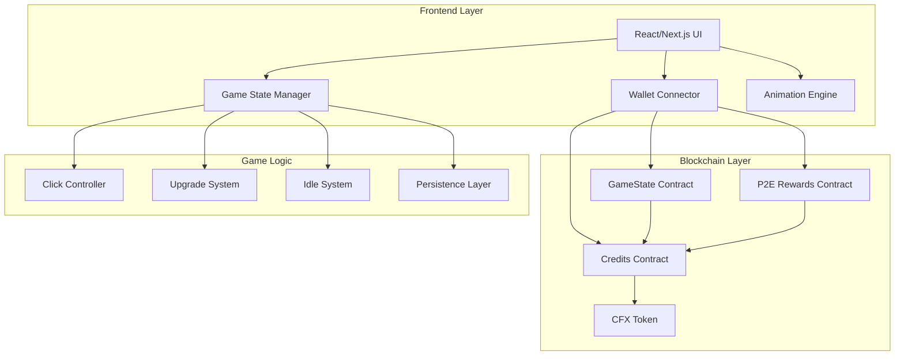

# StarMiner - Technical Architecture

## 🎯 Project Overview

**StarMiner** is a space-themed play-to-earn idle clicker game built on Conflux eSpace, where players collect Stardust by clicking and purchasing upgrades, with blockchain integration for premium Credits and P2E mechanics.

## 🏗️ System Architecture



## 🎮 Game Mechanics Design

### Core Gameplay Loop
1. **Click to Collect**: Players click to generate Stardust
2. **Purchase Upgrades**: Spend Stardust on productivity upgrades
3. **Idle Generation**: Upgrades generate Stardust automatically
4. **Premium Purchases**: Buy Credits with CFX for powerful upgrades
5. **Play-to-Earn**: Exchange accumulated Stardust for CFX rewards

### Currency System
- **Stardust** (Primary): In-game currency earned through gameplay
- **Credits** (Premium): Blockchain-backed currency purchased with CFX
- **CFX** (Base): Conflux eSpace native token for transactions

### Upgrade Tiers
```
Tier 1: Basic Upgrades (Stardust only)
├── Telescope (+1 Stardust/click, +0.1 Stardust/sec)
├── Satellite (+5 Stardust/click, +0.5 Stardust/sec)
└── Observatory (+10 Stardust/click, +1 Stardust/sec)

Tier 2: Advanced Upgrades (Stardust + Credits)
├── Starship (+50 Stardust/click, +5 Stardust/sec)
├── Space Station (+100 Stardust/click, +10 Stardust/sec)
└── Wormhole Generator (+500 Stardust/click, +50 Stardust/sec)

Tier 3: Premium Upgrades (Credits only)
├── Black Hole (+1000 Stardust/click, +100 Stardust/sec)
├── Galactic Network (+5000 Stardust/click, +500 Stardust/sec)
└── Universe Engine (+10000 Stardust/click, +1000 Stardust/sec)
```

## 📱 Frontend Architecture

### Technology Stack
- **Framework**: Next.js 14 with App Router
- **Styling**: TailwindCSS + Framer Motion for animations
- **State Management**: Zustand for game state
- **Web3 Integration**: Ethers.js v6 + Wagmi
- **UI Components**: Headless UI + Custom components

### Component Structure
```
src/
├── app/
│   ├── layout.tsx
│   ├── page.tsx
│   └── globals.css
├── components/
│   ├── game/
│   │   ├── ClickArea.tsx
│   │   ├── StatsPanel.tsx
│   │   ├── UpgradeShop.tsx
│   │   └── StarField.tsx
│   ├── wallet/
│   │   ├── WalletConnect.tsx
│   │   └── WalletStatus.tsx
│   └── ui/
│       ├── Button.tsx
│       ├── Modal.tsx
│       └── LoadingSpinner.tsx
├── hooks/
│   ├── useGameState.ts
│   ├── useWallet.ts
│   └── useContracts.ts
├── lib/
│   ├── contracts.ts
│   ├── gameLogic.ts
│   └── utils.ts
└── types/
    ├── game.ts
    └── contracts.ts
```

### Game State Management
```typescript
interface GameState {
  // Core stats
  stardust: bigint;
  stardustPerClick: bigint;
  stardustPerSecond: bigint;
  totalClicks: number;
  
  // Upgrades
  upgrades: {
    [key: string]: {
      level: number;
      cost: bigint;
      costType: 'stardust' | 'credits';
    };
  };
  
  // Blockchain data
  credits: bigint;
  walletConnected: boolean;
  userAddress: string;
  
  // Game progression
  prestigeLevel: number;
  achievements: string[];
  lastSaveTime: number;
}
```

## ⛓️ Smart Contract Architecture

### Contract Overview
```solidity
// Core contracts for StarMiner P2E system
contracts/
├── StarMinerCredits.sol      // ERC20 Credits token
├── GameStateManager.sol      // On-chain game state
├── P2ERewards.sol           // Play-to-earn mechanics
└── UpgradeNFTs.sol          // NFT-based premium upgrades
```

### StarMinerCredits Contract
```solidity
contract StarMinerCredits is ERC20, Ownable {
    uint256 public constant CREDITS_PER_CFX = 1000; // 1 CFX = 1000 Credits
    
    mapping(address => uint256) public stardustBalance;
    mapping(address => uint256) public lastRewardClaim;
    
    event CreditsPurchased(address indexed user, uint256 cfxAmount, uint256 creditsAmount);
    event StardustDeposited(address indexed user, uint256 amount);
    event RewardsClaimed(address indexed user, uint256 cfxAmount);
    
    function purchaseCredits() external payable;
    function depositStardust(uint256 amount) external;
    function claimRewards() external;
    function getClaimableRewards(address user) external view returns (uint256);
}
```

### GameStateManager Contract
```solidity
contract GameStateManager is Ownable {
    struct PlayerState {
        uint256 stardust;
        uint256 stardustPerSecond;
        uint256 lastUpdateTime;
        mapping(string => uint256) upgradeLevels;
        uint256 prestigeLevel;
        bool isActive;
    }
    
    mapping(address => PlayerState) public playerStates;
    mapping(string => UpgradeConfig) public upgradeConfigs;
    
    event GameStateSaved(address indexed player, uint256 stardust);
    event UpgradePurchased(address indexed player, string upgradeId, uint256 level);
    
    function saveGameState(uint256 stardust, uint256 stardustPerSecond) external;
    function purchaseUpgrade(string memory upgradeId) external;
    function getPlayerState(address player) external view returns (PlayerState memory);
}
```

### P2E Rewards System
```solidity
contract P2ERewards is Ownable {
    uint256 public constant STARDUST_TO_CFX_RATE = 10000; // 10,000 Stardust = 1 CFX
    uint256 public rewardPool;
    uint256 public dailyRewardLimit = 1 ether; // 1 CFX per day max
    
    mapping(address => uint256) public dailyRewardsClaimed;
    mapping(address => uint256) public lastClaimDate;
    
    function exchangeStardustForCFX(uint256 stardustAmount) external;
    function addToRewardPool() external payable;
    function getExchangeRate() external view returns (uint256);
}
```

## 🎨 UI/UX Design Specifications

### Visual Theme: Space & Stars
- **Color Palette**: Deep space blues (#0B1426, #1E3A8A), cosmic purples (#4C1D95, #7C3AED), stellar whites (#F8FAFC), gold accents (#F59E0B)
- **Typography**: Futuristic sans-serif fonts (Inter, Space Grotesk)
- **Animations**: Twinkling stars, pulsing click effects, smooth upgrade transitions
- **Particles**: Floating stardust particles, nebula backgrounds

### Layout Structure
```
┌─────────────────────────────────────────────────────┐
│ Header: Wallet Status | Stardust: XXX | Credits: XXX │
├─────────────────────────────────────────────────────┤
│                                                     │
│  ┌─────────────┐    ┌─────────────────────────────┐ │
│  │             │    │                             │ │
│  │   CLICK     │    │        UPGRADE SHOP         │ │
│  │    AREA     │    │                             │ │
│  │             │    │  🔭 Telescope    [BUY]      │ │
│  │   ⭐ STAR   │    │  🛰️ Satellite    [BUY]      │ │
│  │             │    │  🚀 Starship     [BUY]      │ │
│  │             │    │  🕳️ Black Hole   [BUY]      │ │
│  └─────────────┘    └─────────────────────────────┘ │
│                                                     │
├─────────────────────────────────────────────────────┤
│ Stats: Clicks: XXX | Per Second: XXX | Total: XXX   │
└─────────────────────────────────────────────────────┘
```

## 🔧 Development Environment Setup

### Required Tools
- Node.js 18+
- npm/yarn
- Hardhat for smart contract development
- MetaMask or Fluent Wallet
- Conflux eSpace testnet access

### Environment Variables
```env
# Frontend (.env.local)
NEXT_PUBLIC_CONFLUX_NETWORK=testnet
NEXT_PUBLIC_RPC_URL=https://evmtestnet.confluxrpc.com
NEXT_PUBLIC_CHAIN_ID=71
NEXT_PUBLIC_CREDITS_CONTRACT=0x...
NEXT_PUBLIC_GAMESTATE_CONTRACT=0x...
NEXT_PUBLIC_P2E_CONTRACT=0x...

# Smart Contracts (.env)
PRIVATE_KEY=your_private_key
CONFLUX_RPC_URL=https://evmtestnet.confluxrpc.com
ETHERSCAN_API_KEY=your_api_key
```

## 🚀 Deployment Strategy

### Smart Contract Deployment
1. Deploy to Conflux eSpace testnet first
2. Verify contracts on ConfluxScan
3. Test all functionality thoroughly
4. Deploy to mainnet for production

### Frontend Deployment
1. Build optimized production bundle
2. Deploy to Vercel/Netlify
3. Configure environment variables
4. Set up custom domain

## 📊 Performance Considerations

### Game Performance
- Efficient state updates using requestAnimationFrame
- Debounced blockchain interactions
- Local storage for offline gameplay
- Optimized animations with CSS transforms

### Blockchain Performance
- Batch multiple operations when possible
- Use view functions for read operations
- Implement proper gas estimation
- Cache contract calls where appropriate

## 🔒 Security Measures

### Smart Contract Security
- Use OpenZeppelin contracts as base
- Implement proper access controls
- Add reentrancy guards
- Comprehensive testing suite

### Frontend Security
- Validate all user inputs
- Secure wallet connection handling
- Protect against common web vulnerabilities
- Implement rate limiting for API calls

## 📈 Scalability Plan

### Phase 1: Core Game (Hackathon)
- Basic idle clicker mechanics
- Simple upgrade system
- Wallet integration
- P2E functionality

### Phase 2: Enhanced Features
- NFT upgrades
- Achievement system
- Leaderboards
- Social features

### Phase 3: Advanced GameFi
- Staking mechanisms
- Governance tokens
- Seasonal events
- Guild systems

This architecture provides a solid foundation for building a comprehensive play-to-earn idle clicker game that leverages Conflux eSpace's capabilities while maintaining excellent user experience and security.