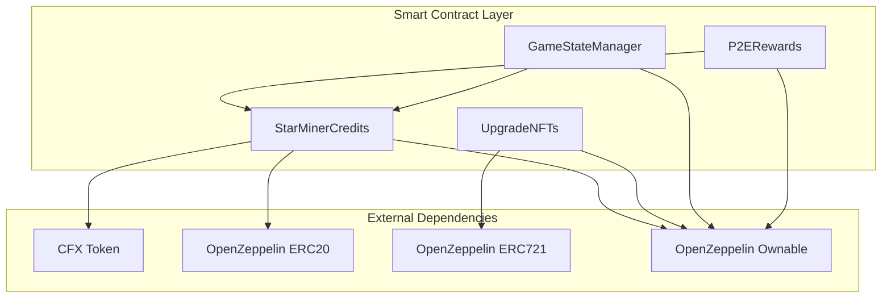

# StarMiner Smart Contracts Specification

## 📋 Contract Overview

The StarMiner game utilizes four main smart contracts deployed on Conflux eSpace to handle the play-to-earn mechanics, game state management, and premium features.

## 🏗️ Contract Architecture



## 📄 Contract Specifications

### 1. StarMinerCredits.sol

**Purpose**: ERC20 token for premium in-game currency with CFX exchange functionality.

```solidity
// SPDX-License-Identifier: MIT
pragma solidity ^0.8.19;

import "@openzeppelin/contracts/token/ERC20/ERC20.sol";
import "@openzeppelin/contracts/access/Ownable.sol";
import "@openzeppelin/contracts/security/ReentrancyGuard.sol";
import "@openzeppelin/contracts/security/Pausable.sol";

contract StarMinerCredits is ERC20, Ownable, ReentrancyGuard, Pausable {
    // Constants
    uint256 public constant CREDITS_PER_CFX = 1000; // 1 CFX = 1000 Credits
    uint256 public constant MIN_PURCHASE = 0.01 ether; // Minimum 0.01 CFX
    uint256 public constant MAX_PURCHASE = 100 ether; // Maximum 100 CFX per transaction
    
    // State variables
    mapping(address => uint256) public stardustBalance;
    mapping(address => uint256) public lastRewardClaim;
    mapping(address => uint256) public totalPurchased;
    
    uint256 public totalCFXCollected;
    uint256 public totalCreditsIssued;
    
    // Events
    event CreditsPurchased(
        address indexed user, 
        uint256 cfxAmount, 
        uint256 creditsAmount,
        uint256 timestamp
    );
    
    event StardustDeposited(
        address indexed user, 
        uint256 amount,
        uint256 timestamp
    );
    
    event RewardsClaimed(
        address indexed user, 
        uint256 cfxAmount,
        uint256 timestamp
    );
    
    event EmergencyWithdraw(
        address indexed owner,
        uint256 amount,
        uint256 timestamp
    );
    
    constructor() ERC20("StarMiner Credits", "SMC") {}
    
    /**
     * @dev Purchase Credits with CFX
     * Rate: 1 CFX = 1000 Credits
     */
    function purchaseCredits() external payable nonReentrant whenNotPaused {
        require(msg.value >= MIN_PURCHASE, "Below minimum purchase");
        require(msg.value <= MAX_PURCHASE, "Above maximum purchase");
        
        uint256 creditsAmount = msg.value * CREDITS_PER_CFX;
        
        _mint(msg.sender, creditsAmount);
        
        totalPurchased[msg.sender] += msg.value;
        totalCFXCollected += msg.value;
        totalCreditsIssued += creditsAmount;
        
        emit CreditsPurchased(msg.sender, msg.value, creditsAmount, block.timestamp);
    }
    
    /**
     * @dev Deposit Stardust for P2E rewards calculation
     * Called by GameStateManager contract
     */
    function depositStardust(address user, uint256 amount) external onlyAuthorized {
        stardustBalance[user] += amount;
        emit StardustDeposited(user, amount, block.timestamp);
    }
    
    /**
     * @dev Claim P2E rewards based on Stardust balance
     * Rate: 10,000 Stardust = 1 CFX (adjustable)
     */
    function claimRewards() external nonReentrant whenNotPaused {
        uint256 claimableAmount = getClaimableRewards(msg.sender);
        require(claimableAmount > 0, "No rewards to claim");
        require(address(this).balance >= claimableAmount, "Insufficient contract balance");
        
        stardustBalance[msg.sender] = 0;
        lastRewardClaim[msg.sender] = block.timestamp;
        
        (bool success, ) = payable(msg.sender).call{value: claimableAmount}("");
        require(success, "Transfer failed");
        
        emit RewardsClaimed(msg.sender, claimableAmount, block.timestamp);
    }
    
    /**
     * @dev Calculate claimable CFX rewards from Stardust
     */
    function getClaimableRewards(address user) public view returns (uint256) {
        uint256 stardust = stardustBalance[user];
        if (stardust < 10000) return 0; // Minimum 10,000 Stardust to claim
        
        // Rate: 10,000 Stardust = 1 CFX
        uint256 cfxAmount = (stardust / 10000) * 1 ether;
        
        // Daily limit: 1 CFX per day
        if (block.timestamp < lastRewardClaim[user] + 1 days) {
            return 0;
        }
        
        // Cap at contract balance
        uint256 contractBalance = address(this).balance;
        return cfxAmount > contractBalance ? contractBalance : cfxAmount;
    }
    
    /**
     * @dev Burn Credits (for upgrade purchases)
     */
    function burnCredits(address user, uint256 amount) external onlyAuthorized {
        _burn(user, amount);
    }
    
    // Admin functions
    mapping(address => bool) public authorizedContracts;
    
    modifier onlyAuthorized() {
        require(authorizedContracts[msg.sender] || msg.sender == owner(), "Not authorized");
        _;
    }
    
    function setAuthorizedContract(address contractAddr, bool authorized) external onlyOwner {
        authorizedContracts[contractAddr] = authorized;
    }
    
    function pause() external onlyOwner {
        _pause();
    }
    
    function unpause() external onlyOwner {
        _unpause();
    }
    
    function emergencyWithdraw() external onlyOwner {
        uint256 balance = address(this).balance;
        (bool success, ) = payable(owner()).call{value: balance}("");
        require(success, "Transfer failed");
        emit EmergencyWithdraw(owner(), balance, block.timestamp);
    }
    
    // Receive CFX for rewards pool
    receive() external payable {}
}
```

### 2. GameStateManager.sol

**Purpose**: Manages on-chain game state, upgrades, and progression tracking.

```solidity
// SPDX-License-Identifier: MIT
pragma solidity ^0.8.19;

import "@openzeppelin/contracts/access/Ownable.sol";
import "@openzeppelin/contracts/security/ReentrancyGuard.sol";
import "./StarMinerCredits.sol";

contract GameStateManager is Ownable, ReentrancyGuard {
    StarMinerCredits public creditsContract;
    
    struct PlayerState {
        uint256 stardust;
        uint256 stardustPerSecond;
        uint256 totalClicks;
        uint256 lastUpdateTime;
        uint256 prestigeLevel;
        bool isActive;
    }
    
    struct UpgradeConfig {
        string name;
        uint256 baseCost;
        uint256 costMultiplier; // Multiplied by 1000 for precision
        uint256 stardustPerClick;
        uint256 stardustPerSecond;
        string costType; // "stardust" or "credits"
        bool isActive;
    }
    
    // State mappings
    mapping(address => PlayerState) public playerStates;
    mapping(address => mapping(string => uint256)) public playerUpgrades;
    mapping(string => UpgradeConfig) public upgradeConfigs;
    
    // Game statistics
    mapping(address => uint256) public totalStardustEarned;
    mapping(address => uint256) public totalCreditsSpent;
    uint256 public totalPlayers;
    uint256 public totalStardustGenerated;
    
    // Events
    event GameStateSaved(
        address indexed player,
        uint256 stardust,
        uint256 stardustPerSecond,
        uint256 timestamp
    );
    
    event UpgradePurchased(
        address indexed player,
        string upgradeId,
        uint256 level,
        uint256 cost,
        string costType,
        uint256 timestamp
    );
    
    event PlayerRegistered(address indexed player, uint256 timestamp);
    event PrestigeActivated(address indexed player, uint256 level, uint256 timestamp);
    
    constructor(address _creditsContract) {
        creditsContract = StarMinerCredits(_creditsContract);
        _initializeUpgrades();
    }
    
    /**
     * @dev Initialize default upgrade configurations
     */
    function _initializeUpgrades() private {
        // Tier 1: Basic Upgrades (Stardust only)
        upgradeConfigs["telescope"] = UpgradeConfig({
            name: "Telescope",
            baseCost: 10,
            costMultiplier: 1150, // 15% increase per level
            stardustPerClick: 1,
            stardustPerSecond: 0,
            costType: "stardust",
            isActive: true
        });
        
        upgradeConfigs["satellite"] = UpgradeConfig({
            name: "Satellite",
            baseCost: 100,
            costMultiplier: 1150,
            stardustPerClick: 5,
            stardustPerSecond: 1,
            costType: "stardust",
            isActive: true
        });
        
        upgradeConfigs["observatory"] = UpgradeConfig({
            name: "Observatory",
            baseCost: 1000,
            costMultiplier: 1150,
            stardustPerClick: 10,
            stardustPerSecond: 5,
            costType: "stardust",
            isActive: true
        });
        
        // Tier 2: Advanced Upgrades (Credits)
        upgradeConfigs["starship"] = UpgradeConfig({
            name: "Starship",
            baseCost: 10,
            costMultiplier: 1200, // 20% increase per level
            stardustPerClick: 50,
            stardustPerSecond: 25,
            costType: "credits",
            isActive: true
        });
        
        upgradeConfigs["blackhole"] = UpgradeConfig({
            name: "Black Hole",
            baseCost: 100,
            costMultiplier: 1250, // 25% increase per level
            stardustPerClick: 500,
            stardustPerSecond: 250,
            costType: "credits",
            isActive: true
        });
    }
    
    /**
     * @dev Register new player
     */
    function registerPlayer() external {
        if (!playerStates[msg.sender].isActive) {
            playerStates[msg.sender] = PlayerState({
                stardust: 0,
                stardustPerSecond: 1, // Base generation
                totalClicks: 0,
                lastUpdateTime: block.timestamp,
                prestigeLevel: 0,
                isActive: true
            });
            totalPlayers++;
            emit PlayerRegistered(msg.sender, block.timestamp);
        }
    }
    
    /**
     * @dev Save game state and calculate idle rewards
     */
    function saveGameState(
        uint256 stardust,
        uint256 totalClicks
    ) external nonReentrant {
        require(playerStates[msg.sender].isActive, "Player not registered");
        
        PlayerState storage player = playerStates[msg.sender];
        
        // Calculate idle rewards
        uint256 timeDiff = block.timestamp - player.lastUpdateTime;
        uint256 idleRewards = (player.stardustPerSecond * timeDiff);
        
        // Update state
        player.stardust = stardust + idleRewards;
        player.totalClicks = totalClicks;
        player.lastUpdateTime = block.timestamp;
        
        // Update global stats
        totalStardustEarned[msg.sender] += idleRewards;
        totalStardustGenerated += idleRewards;
        
        // Deposit stardust for P2E rewards
        if (idleRewards > 0) {
            creditsContract.depositStardust(msg.sender, idleRewards);
        }
        
        emit GameStateSaved(msg.sender, player.stardust, player.stardustPerSecond, block.timestamp);
    }
    
    /**
     * @dev Purchase upgrade
     */
    function purchaseUpgrade(string memory upgradeId) external nonReentrant {
        require(playerStates[msg.sender].isActive, "Player not registered");
        require(upgradeConfigs[upgradeId].isActive, "Upgrade not available");
        
        UpgradeConfig memory config = upgradeConfigs[upgradeId];
        uint256 currentLevel = playerUpgrades[msg.sender][upgradeId];
        
        // Calculate cost
        uint256 cost = _calculateUpgradeCost(config.baseCost, config.costMultiplier, currentLevel);
        
        // Check and deduct payment
        if (keccak256(bytes(config.costType)) == keccak256(bytes("stardust"))) {
            require(playerStates[msg.sender].stardust >= cost, "Insufficient stardust");
            playerStates[msg.sender].stardust -= cost;
        } else {
            require(creditsContract.balanceOf(msg.sender) >= cost, "Insufficient credits");
            creditsContract.burnCredits(msg.sender, cost);
            totalCreditsSpent[msg.sender] += cost;
        }
        
        // Apply upgrade
        playerUpgrades[msg.sender][upgradeId]++;
        playerStates[msg.sender].stardustPerSecond += config.stardustPerSecond;
        
        emit UpgradePurchased(
            msg.sender,
            upgradeId,
            currentLevel + 1,
            cost,
            config.costType,
            block.timestamp
        );
    }
    
    /**
     * @dev Calculate upgrade cost with exponential scaling
     */
    function _calculateUpgradeCost(
        uint256 baseCost,
        uint256 multiplier,
        uint256 level
    ) private pure returns (uint256) {
        if (level == 0) return baseCost;
        
        uint256 cost = baseCost;
        for (uint256 i = 0; i < level; i++) {
            cost = (cost * multiplier) / 1000;
        }
        return cost;
    }
    
    /**
     * @dev Get upgrade cost for next level
     */
    function getUpgradeCost(string memory upgradeId, address player) external view returns (uint256) {
        UpgradeConfig memory config = upgradeConfigs[upgradeId];
        uint256 currentLevel = playerUpgrades[player][upgradeId];
        return _calculateUpgradeCost(config.baseCost, config.costMultiplier, currentLevel);
    }
    
    /**
     * @dev Get player's complete state
     */
    function getPlayerState(address player) external view returns (
        PlayerState memory state,
        uint256 idleRewards
    ) {
        state = playerStates[player];
        if (state.isActive) {
            uint256 timeDiff = block.timestamp - state.lastUpdateTime;
            idleRewards = state.stardustPerSecond * timeDiff;
        }
    }
    
    /**
     * @dev Activate prestige (reset progress for bonuses)
     */
    function activatePrestige() external {
        require(playerStates[msg.sender].stardust >= 1000000, "Need 1M stardust for prestige");
        
        PlayerState storage player = playerStates[msg.sender];
        player.prestigeLevel++;
        player.stardust = 0;
        player.stardustPerSecond = 1 + player.prestigeLevel; // Prestige bonus
        
        // Reset upgrades
        string[5] memory upgradeIds = ["telescope", "satellite", "observatory", "starship", "blackhole"];
        for (uint256 i = 0; i < upgradeIds.length; i++) {
            playerUpgrades[msg.sender][upgradeIds[i]] = 0;
        }
        
        emit PrestigeActivated(msg.sender, player.prestigeLevel, block.timestamp);
    }
    
    // Admin functions
    function addUpgrade(
        string memory upgradeId,
        string memory name,
        uint256 baseCost,
        uint256 costMultiplier,
        uint256 stardustPerClick,
        uint256 stardustPerSecond,
        string memory costType
    ) external onlyOwner {
        upgradeConfigs[upgradeId] = UpgradeConfig({
            name: name,
            baseCost: baseCost,
            costMultiplier: costMultiplier,
            stardustPerClick: stardustPerClick,
            stardustPerSecond: stardustPerSecond,
            costType: costType,
            isActive: true
        });
    }
    
    function toggleUpgrade(string memory upgradeId) external onlyOwner {
        upgradeConfigs[upgradeId].isActive = !upgradeConfigs[upgradeId].isActive;
    }
}
```

### 3. P2ERewards.sol

**Purpose**: Handles play-to-earn reward distribution and exchange mechanics.

```solidity
// SPDX-License-Identifier: MIT
pragma solidity ^0.8.19;

import "@openzeppelin/contracts/access/Ownable.sol";
import "@openzeppelin/contracts/security/ReentrancyGuard.sol";
import "./StarMinerCredits.sol";

contract P2ERewards is Ownable, ReentrancyGuard {
    StarMinerCredits public creditsContract;
    
    // Reward configuration
    uint256 public stardustToCFXRate = 10000; // 10,000 Stardust = 1 CFX
    uint256 public dailyRewardLimit = 1 ether; // 1 CFX per day max
    uint256 public minimumStardust = 10000; // Minimum to exchange
    
    // Reward pool management
    uint256 public rewardPool;
    uint256 public totalRewardsDistributed;
    uint256 public rewardPoolFeePercent = 5; // 5% of Credits purchases go to reward pool
    
    // Player tracking
    mapping(address => uint256) public dailyRewardsClaimed;
    mapping(address => uint256) public lastClaimDate;
    mapping(address => uint256) public totalRewardsClaimed;
    
    // Events
    event RewardPoolFunded(uint256 amount, uint256 timestamp);
    event StardustExchanged(
        address indexed player,
        uint256 stardustAmount,
        uint256 cfxAmount,
        uint256 timestamp
    );
    event RewardRateUpdated(uint256 newRate, uint256 timestamp);
    event DailyLimitUpdated(uint256 newLimit, uint256 timestamp);
    
    constructor(address _creditsContract) {
        creditsContract = StarMinerCredits(_creditsContract);
    }
    
    /**
     * @dev Exchange Stardust for CFX rewards
     */
    function exchangeStardustForCFX(uint256 stardustAmount) external nonReentrant {
        require(stardustAmount >= minimumStardust, "Below minimum exchange amount");
        require(creditsContract.stardustBalance(msg.sender) >= stardustAmount, "Insufficient stardust");
        
        // Check daily limit
        if (block.timestamp >= lastClaimDate[msg.sender] + 1 days) {
            dailyRewardsClaimed[msg.sender] = 0;
            lastClaimDate[msg.sender] = block.timestamp;
        }
        
        // Calculate CFX amount
        uint256 cfxAmount = (stardustAmount * 1 ether) / stardustToCFXRate;
        
        require(dailyRewardsClaimed[msg.sender] + cfxAmount <= dailyRewardLimit, "Daily limit exceeded");
        require(rewardPool >= cfxAmount, "Insufficient reward pool");
        
        // Update balances
        creditsContract.depositStardust(msg.sender, 0); // Reset stardust balance
        dailyRewardsClaimed[msg.sender] += cfxAmount;
        totalRewardsClaimed[msg.sender] += cfxAmount;
        rewardPool -= cfxAmount;
        totalRewardsDistributed += cfxAmount;
        
        // Transfer CFX
        (bool success, ) = payable(msg.sender).call{value: cfxAmount}("");
        require(success, "Transfer failed");
        
        emit StardustExchanged(msg.sender, stardustAmount, cfxAmount, block.timestamp);
    }
    
    /**
     * @dev Add funds to reward pool (called by Credits contract)
     */
    function fundRewardPool() external payable {
        rewardPool += msg.value;
        emit RewardPoolFunded(msg.value, block.timestamp);
    }
    
    /**
     * @dev Get exchange rate and limits for player
     */
    function getExchangeInfo(address player) external view returns (
        uint256 rate,
        uint256 dailyLimit,
        uint256 remainingDaily,
        uint256 poolBalance,
        uint256 playerStardust
    ) {
        rate = stardustToCFXRate;
        dailyLimit = dailyRewardLimit;
        poolBalance = rewardPool;
        playerStardust = creditsContract.stardustBalance(player);
        
        if (block.timestamp >= lastClaimDate[player] + 1 days) {
            remainingDaily = dailyLimit;
        } else {
            remainingDaily = dailyLimit - dailyRewardsClaimed[player];
        }
    }
    
    /**
     * @dev Calculate maximum CFX claimable for player
     */
    function getMaxClaimable(address player) external view returns (uint256) {
        uint256 stardustBalance = creditsContract.stardustBalance(player);
        if (stardustBalance < minimumStardust) return 0;
        
        uint256 cfxFromStardust = (stardustBalance * 1 ether) / stardustToCFXRate;
        
        uint256 remainingDaily;
        if (block.timestamp >= lastClaimDate[player] + 1 days) {
            remainingDaily = dailyRewardLimit;
        } else {
            remainingDaily = dailyRewardLimit - dailyRewardsClaimed[player];
        }
        
        uint256 maxClaimable = cfxFromStardust > remainingDaily ? remainingDaily : cfxFromStardust;
        return maxClaimable > rewardPool ? rewardPool : maxClaimable;
    }
    
    // Admin functions
    function setExchangeRate(uint256 newRate) external onlyOwner {
        require(newRate > 0, "Rate must be positive");
        stardustToCFXRate = newRate;
        emit RewardRateUpdated(newRate, block.timestamp);
    }
    
    function setDailyLimit(uint256 newLimit) external onlyOwner {
        dailyRewardLimit = newLimit;
        emit DailyLimitUpdated(newLimit, block.timestamp);
    }
    
    function setMinimumStardust(uint256 newMinimum) external onlyOwner {
        minimumStardust = newMinimum;
    }
    
    function emergencyWithdraw() external onlyOwner {
        uint256 balance = address(this).balance;
        (bool success, ) = payable(owner()).call{value: balance}("");
        require(success, "Transfer failed");
    }
    
    // Receive CFX for reward pool
    receive() external payable {
        rewardPool += msg.value;
        emit RewardPoolFunded(msg.value, block.timestamp);
    }
}
```

### 4. UpgradeNFTs.sol

**Purpose**: NFT-based premium upgrades with unique bonuses and trading capabilities.

```solidity
// SPDX-License-Identifier: MIT
pragma solidity ^0.8.19;

import "@openzeppelin/contracts/token/ERC721/ERC721.sol";
import "@openzeppelin/contracts/access/Ownable.sol";
import "@openzeppelin/contracts/utils/Counters.sol";
import "./StarMinerCredits.sol";

contract UpgradeNFTs is ERC721, Ownable {
    using Counters for Counters.Counter;
    
    StarMinerCredits public creditsContract;
    Counters.Counter private _tokenIds;
    
    struct NFTUpgrade {
        string name;
        uint256 stardustMultiplier; // Multiplied by 1000 for precision
        uint256 clickMultiplier;
        uint256 rarity; // 1=Common, 2=Rare, 3=Epic, 4=Legendary
        uint256 mintPrice;
        bool isActive;
    }
    
    mapping(uint256 => NFTUpgrade) public nftUpgrades;
    mapping(address => uint256[]) public playerNFTs;
    mapping(uint256 => string) private _tokenURIs;
    
    // Events
    event NFTMinted(
        address indexed player,
        uint256 indexed tokenId,
        string upgradeName,
        uint256 rarity,
        uint256 timestamp
    );
    
    constructor(address _creditsContract) ERC721("StarMiner Upgrades", "SMU") {
        creditsContract = StarMinerCredits(_creditsContract);
        _initializeNFTUpgrades();
    }
    
    function _initializeNFTUpgrades() private {
        // Common upgrades
        nftUpgrades[1] = NFTUpgrade({
            name: "Stellar Compass",
            stardustMultiplier: 1100, // 10% bonus
            clickMultiplier: 1050, // 5% bonus
            rarity: 1,
            mintPrice: 50,
            isActive: true
        });
        
        // Rare upgrades
        nftUpgrades[2] = NFTUpgrade({
            name: "Quantum Telescope",
            stardustMultiplier: 1250, // 25% bonus
            clickMultiplier: 1150, // 15% bonus
            rarity: 2,
            mintPrice: 200,
            isActive: true
        });
        
        // Epic upgrades
        nftUpgrades[3] = NFTUpgrade({
            name: "Cosmic Harvester",
            stardustMultiplier: 1500, // 50% bonus
            clickMultiplier: 1300, // 30% bonus
            rarity: 3,
            mintPrice: 500,
            isActive: true
        });
        
        // Legendary upgrades
        nftUpgrades[4] = NFTUpgrade({
            name: "Universe Core",
            stardustMultiplier: 2000, // 100% bonus
            clickMultiplier: 1500, // 50% bonus
            rarity: 4,
            mintPrice: 1000,
            isActive: true
        });
    }
    
    function mintNFTUpgrade(uint256 upgradeType) external {
        require(nftUpgrades[upgradeType].isActive, "Upgrade not available");
        require(
            creditsContract.balanceOf(msg.sender) >= nftUpgrades[upgradeType].mintPrice,
            "Insufficient credits"
        );
        
        // Burn credits
        creditsContract.burnCredits(msg.sender, nftUpgrades[upgradeType].mintPrice);
        
        // Mint NFT
        _tokenIds.increment();
        uint256 newTokenId = _tokenIds.current();
        
        _mint(msg.sender, newTokenId);
        playerNFTs[msg.sender].push(newTokenId);
        
        emit NFTMinted(
            msg.sender,
            newTokenId,
            nftUpgrades[upgradeType].name,
            nftUpgrades[upgradeType].rarity,
            block.timestamp
        );
    }
    
    function getPlayerMultipliers(address player) external view returns (
        uint256 stardustMultiplier,
        uint256 clickMultiplier
    ) {
        stardustMultiplier = 1000; // Base 100%
        clickMultiplier = 1000; // Base 100%
        
        uint256[] memory tokens = playerNFTs[player];
        for (uint256 i = 0; i < tokens.length; i++) {
            uint256 tokenId = tokens[i];
            if (_exists(tokenId) && ownerOf(tokenId) == player) {
                // Find upgrade type for this token
                for (uint256 j = 1; j <= 4; j++) {
                    if (nftUpgrades[j].isActive) {
                        stardustMultiplier = (stardustMultiplier * nftUpgrades[j].stardustMultiplier) / 1000;
                        clickMultiplier = (clickMultiplier * nftUpgrades[j].clickMultiplier) / 1000;
                        break;
                    }
                }
            }
        }
    }
    
    function tokenURI(uint256 tokenId) public view virtual override returns (string memory) {
        require(_exists(tokenId), "Token does not exist");
        return _tokenURIs[tokenId];
    }
    
    function setTokenURI(uint256 tokenId, string memory uri) external onlyOwner {
        _tokenURIs[tokenId] = uri;
    }
}
```

## 🚀 Deployment Configuration

### Hardhat Configuration

```javascript
// hardhat.config.js
require("@nomicfoundation/hardhat-toolbox");
require("dotenv").config();

module.exports = {
  solidity: {
    version: "0.8.19",
    settings: {
      optimizer: {
        enabled: true,
        runs: 200
      }
    }
  },
  networks: {
    confluxTestnet: {
      url: "https://evmtestnet.confluxrpc.com",
      accounts: [process.env.PRIVATE_KEY],
      chainId: 71
    },
    confluxMainnet: {
      url: "https://evm.confluxrpc.com",
      accounts: [process.env.PRIVATE_KEY],
      chainId: 1030
    }
  },
  etherscan: {
    apiKey: {
      confluxTestnet: process.env.CONFLUXSCAN_API_KEY,
      confluxMainnet: process.env.CONFLUXSCAN_API_KEY
    },
    customChains: [
      {
        network: "confluxTestnet",
        chainId: 71,
        urls: {
          apiURL: "https://evmapi-testnet